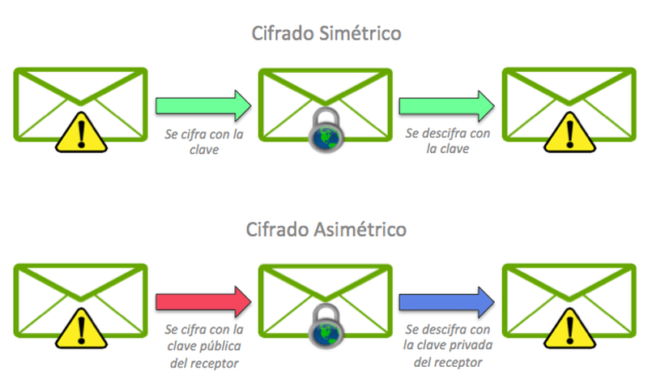
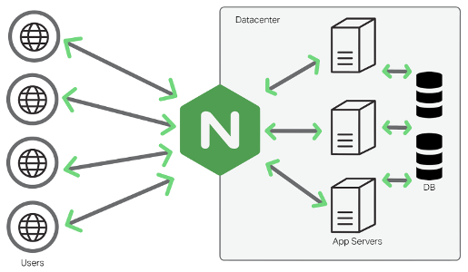
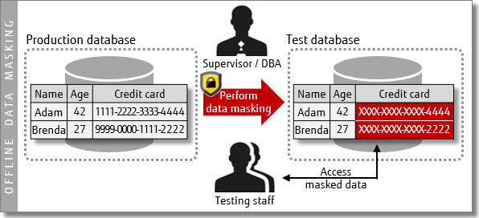

# 0.1. Jean Pierre Tinco - Cifrado de datos

# 1) Desarrollo conceptual

**¿Qué es el cifrado de datos?**

Es una técnica de seguridad que protege la información al convertirla en un formato ilegible para quienes no tienen la clave adecuada para descifrarla. Consiste en transformar los datos originales, conocidos como texto plano, en un conjunto de caracteres o símbolos incomprensibles, llamado texto cifrado o criptográfico. Este proceso se lleva a cabo mediante algoritmos criptográficos, y solo las personas autorizadas con la clave de descifrado pueden revertirlo y acceder a la información original.

**Tipos de cifrado de datos**

### Cifrado Simétrico

El cifrado simétrico utiliza la misma clave tanto para cifrar como para descifrar la información. Esto significa que ambas partes deben tener acceso a la clave secreta para poder comunicarse de manera segura.

**Beneficios y Ventajas:**
- **Rapidez**: Generalmente, los algoritmos simétricos son más rápidos que los asimétricos, lo que los hace adecuados para cifrar grandes volúmenes de datos.
- **Simplicidad**: La gestión de claves es más sencilla, ya que solo se necesita una clave para ambas operaciones (cifrado y descifrado).

#### Ejemplo de cifrado de datos simétrico

**Escenario:** Cifrado de un disco duro en una empresa  
**Descripción:** Una empresa cifra el disco duro que almacena datos sensibles para proteger la información de accesos no autorizados en caso de robo o pérdida.  
**Por qué se usa cifrado simétrico:**
- **Rendimiento:** Es más rápido y eficiente, permitiendo cifrar grandes volúmenes de datos rápidamente.
- **Facilidad de Implementación:** Utiliza una sola clave, simplificando la gestión siempre que se mantenga en secreto.
- **Costo:** Generalmente requiere menos recursos computacionales que el cifrado asimétrico, lo cual es clave para empresas con grandes volúmenes de datos.
- **Acceso Controlado:** El disco duro solo tiene acceso la empresa, lo que hace que el cifrado simétrico sea más conveniente en este escenario.

### Cifrado Asimétrico

El cifrado asimétrico utiliza un par de claves: una clave pública y una clave privada. La clave pública se utiliza para cifrar la información, mientras que la clave privada se utiliza para descifrarla. Esto permite que las personas compartan su clave pública sin comprometer la seguridad de su clave privada.

**Beneficios y Ventajas:**
- **Seguridad mejorada**: La clave privada nunca se comparte, lo que reduce el riesgo de comprometer la seguridad.
- **Intercambio seguro**: Facilita el intercambio seguro de información sin necesidad de compartir una clave secreta previamente.

#### Ejemplo de cifrado de datos asimétrico

**Escenario:** Comunicaciones seguras en un servicio de correo electrónico  
**Descripción:** Un usuario envía un correo confidencial a un colega utilizando claves públicas y privadas para el cifrado.  
**Por qué se usa cifrado asimétrico:**
- **Intercambio Seguro de Claves:** El remitente cifra el mensaje con la clave pública del destinatario, asegurando que solo este pueda descifrarlo.
- **Autenticación:** El remitente puede firmar el correo digitalmente, permitiendo al destinatario verificar su autenticidad con la clave pública.
- **Sin compartir claves:** El cifrado asimétrico evita la necesidad de compartir claves, añadiendo seguridad en comunicaciones por Internet.
- **Acceso Múltiple:** Dado que el servicio de correo involucra a varias personas, el cifrado asimétrico es más adecuado para garantizar la seguridad en las comunicaciones.

## Introducción a Cifrado en Tránsito y Reposo

Ante el aumento constante de ciberataques y amenazas a la seguridad de la información, especialmente en el ámbito web, como se ve en la imagen que muestra que este es el segundo sector más afectado, han surgido diversos métodos de cifrado. Estos enfoques permiten proteger la información tanto en tránsito como en reposo. Gracias a ellos, se garantiza que los datos permanezcan confidenciales y sean accesibles únicamente para personas autorizadas.

## Cifrado en tránsito

El cifrado en tránsito se refiere a la protección de datos mientras se transfieren entre dos puntos, como entre un servidor y un cliente. Esto se realiza para evitar que la información sea interceptada o modificada por un tercero durante el proceso de transmisión.

**Por qué se usa cifrado en tránsito:**
- **Protección de Datos:** Asegura que la información sensible, como contraseñas y datos personales, no sea accesible a atacantes durante su transmisión.
- **Confidencialidad:** Garantiza que solo el remitente y el destinatario puedan acceder a la información, manteniéndola a salvo de miradas indiscretas.

### Uso de NGINX como Reverso Proxy para Cifrado en Tránsito

NGINX es un servidor web y un reverso proxy que se utiliza comúnmente para manejar el cifrado en tránsito. Funciona como intermediario entre los clientes y los servidores, cifrando las comunicaciones que pasan a través de él. Esto se logra mediante la implementación de SSL/TLS (Secure Sockets Layer/Transport Layer Security), lo que permite asegurar que la información transmitida entre el cliente y el servidor esté cifrada y protegida de posibles interceptaciones.

**¿Cómo funciona NGINX como reverso proxy?**
1. **Recepción de Solicitudes:** NGINX recibe las solicitudes del cliente (por ejemplo, un navegador) y actúa como intermediario.
2. **Cifrado:** Utiliza SSL/TLS para cifrar los datos antes de enviarlos al servidor de destino, asegurando que la información sea inaccesible para terceros durante la transmisión.
3. **Desencriptación:** Cuando el servidor responde, NGINX descifra la información y la envía de vuelta al cliente, manteniendo la confidencialidad de los datos en tránsito.

**¿Por qué es ampliamente utilizado?**
- **Escalabilidad:** NGINX maneja un gran número de conexiones simultáneas, lo que lo hace ideal para aplicaciones web de alto tráfico.
- **Rendimiento:** Su capacidad para servir contenido estático y gestionar múltiples conexiones de manera eficiente lo convierte en una opción popular para optimizar el rendimiento.
- **Seguridad:** La implementación de SSL/TLS a través de NGINX ayuda a proteger la información sensible, convirtiéndolo en una herramienta valiosa para las empresas que buscan garantizar la seguridad de sus datos en tránsito.

## Cifrado en reposo

El cifrado en reposo se refiere a la protección de datos que están almacenados en un dispositivo, como discos duros, servidores o bases de datos. Su objetivo es mantener la seguridad de la información cuando no está en uso.

**Por qué se usa cifrado en reposo:**
- **Seguridad de Almacenamiento:** Protege los datos contra accesos no autorizados en caso de robo o pérdida del dispositivo de almacenamiento.
- **Cumplimiento Normativo:** Ayuda a cumplir con regulaciones y estándares de seguridad que exigen la protección de datos sensibles.

## Uso de pgcrypto para Cifrado en Reposo

`pgcrypto` es un módulo de PostgreSQL que proporciona funcionalidades para el cifrado y descifrado de datos. Se utiliza comúnmente para proteger la información sensible antes de ser almacenada en una base de datos, asegurando que incluso si un atacante accede a la base de datos, no podrá leer los datos sin la clave de descifrado.

### ¿Cómo funciona pgcrypto?

1. **Generación de Clave**: Se genera una clave secreta que se utilizará para cifrar y descifrar los datos. Esta clave se gestiona de forma segura para evitar compromisos.

2. **Cifrado de Datos**: Los datos sensibles, como contraseñas o información personal, se cifran utilizando funciones criptográficas proporcionadas por el módulo `pgcrypto`, como `pgp_sym_encrypt`.

3. **Almacenamiento de Datos Cifrados**: Los datos cifrados se almacenan en la base de datos, asegurando que permanezcan protegidos incluso en caso de acceso no autorizado.

4. **Desencriptación**: Cuando se necesita acceder a los datos, se utiliza la clave secreta para descifrarlos mediante funciones como `pgp_sym_decrypt`, obteniendo así la información original.

### ¿Por qué es ampliamente utilizado?

- **Simplicidad**: La integración de `pgcrypto` en PostgreSQL es directa y no requiere bibliotecas externas, lo que permite a los desarrolladores implementar cifrado de manera rápida y eficiente.

- **Versatilidad**: Soporta varios algoritmos de cifrado, lo que permite a las aplicaciones elegir el que mejor se adapte a sus necesidades de seguridad.

- **Seguridad Robustecida**: Ayuda a proteger datos sensibles, asegurando que incluso si los datos son robados, no pueden ser utilizados sin la clave de descifrado.

# 2) Consideraciones Técnicas

Para implementar NGINX como un reverse proxy para el cifrado de datos, se utilizó una imagen de Docker. Por lo tanto, es necesario tener Docker Desktop instalado en tu máquina. Si aún no lo tienes, aquí te proporciono un video con las instrucciones para descargar Docker.

## Instalación de Docker Desktop

[Instrucciones para instalar Docker Desktop](https://www.youtube.com/watch?v=ZO4KWQfUBBc)

## Instalación de NGINX con Docker

Para usar NGINX como un reverse proxy, lo primero que debemos hacer es generar las claves privadas y el certificado. Para ello, crea una carpeta llamada "ssl" en tu aplicación de frontend, ya sea que la tengas en React, Angular o Vue. La estructura debería verse así:

## Instalación de las Firmas Autofirmadas

Una vez realizada la carpeta, abre Ubuntu y ejecuta los siguientes comandos:

 

Al ejecutar el comando `openssl req -x509 -nodes -days 365 -newkey rsa:2048 -keyout private.key -out certificate.crt`, se te pedirán datos como tu correo electrónico, nombre y dominio. Debes proporcionar tus datos personales; para el dominio, puedes usar `localhost`. Al finalizar el proceso, dentro de tu carpeta `ssl` deberían aparecer las llaves, que se verán así:

## Levantar React y NGINX

Ahora, para utilizar estas firmas que ayudarán al cifrado de datos, primero levanta la aplicación React creando un `Dockerfile`, como se muestra en la imagen:

Una vez creado, agrega el siguiente código, que servirá para levantar la aplicación en Docker:

Luego, crea un archivo `nginx.conf` fuera de la carpeta de la aplicación React. La estructura debería verse así:

Dentro de `nginx.conf`, debes agregar el siguiente código, que se encargará de cifrar los datos en tránsito, cambiando el puerto HTTP (80) al puerto HTTPS (443) mediante las firmas generadas en `ssl`. Esto garantizará que los datos se cifren al viajar de la aplicación cliente (React) al NGINX y de NGINX al servidor:

Finalmente, crea el archivo `docker-compose.yml` para levantar estos servicios de React y NGINX. El código debería ser el siguiente:

Una vez realizado todo esto, abre una terminal y ejecuta el comando `docker-compose up --build` para levantar los servicios. Su estructura debería verse así:

Al finalizar, podrás ver la aplicación en React corriendo en `localhost:3000`:

## Pruebas en el Front-end

Una vez completado, podrás enviar información, la cual estará cifrada en tránsito gracias al NGINX que hace la conversión del puerto HTTP a HTTPS. A continuación, se muestran imágenes de un login y un pago con tarjetas de crédito, donde se puede verificar que la información está cifrada en tránsito:

### Login

### Pagos con Tarjetas

## Instalación de pgcrypto

Para instalar `pgcrypto` y usarlo como cifrado en reposo, primero localiza tu base de datos. Una vez hecho esto, ejecuta el siguiente comando para habilitar esta extensión en PostgreSQL:

En mi caso, muestra un error porque ya está instalada, pero a ti debería aparecer "extensión instalada".

Una vez completado esto, ahora puedes usar estas librerías en los endpoints para cifrar los datos en reposo. Primero, importa las librerías y luego úsalas en los endpoints. A continuación, se muestra cómo importar la librería y cómo usarla en los endpoints:

### Librería

### Encriptando en Reposo en la Base de Datos PostgreSQL

## Descriptando el Dato

# 3) Demo

## Video

https://www.youtube.com/watch?v=v3cHzlXtX0Q

## Repositorios
https://github.com/JeanPierreTB/Cifrado_Datos_Frontend

https://github.com/JeanPierreTB/Cifrado_Datos_Backend

# Referencias

Arnaud. (2023, febrero 23). Cifrado simétrico vs. asimétrico: ¿cuál es la diferencia? Mailfence Blog; Mailfence. https://blog.mailfence.com/es/cifrado-simetrico-vs-asimetrico/

NGINX reverse proxy. (s/f). Nginx.com. Recuperado el 13 de octubre de 2024, de https://docs.nginx.com/nginx/admin-guide/web-server/reverse-proxy/

Palentino Blog - Cifrado de datos en reposo en diferentes sistemas de gestión de Bases de Datos. (s/f). Palentino.es. Recuperado el 13 de octubre de 2024, de https://www.palentino.es/blog/cifrado-de-datos-en-reposo-en-diferentes-sistemas-de-gestion-de-bases-de-datos/

(S/f). Amazon.com. Recuperado el 13 de octubre de 2024, de https://docs.aws.amazon.com/es_es/emr/latest/ManagementGuide/emr-data-encryption.html

# Patrón *Static Content Hosting*

## Definicion

El patrón de static content hosting se refiere a una arquitectura de distribución de contenido donde se almacenan y sirven archivos estáticos, como imágenes, estilos CSS y JavaScript, desde un servidor o servicio especializado. Este enfoque permite una entrega rápida y eficiente, ya que los archivos estáticos no requieren procesamiento del lado del servidor. Aunque muchas aplicaciones web manejan tanto contenido estático como dinámico, este patrón se centra en la optimización de los recursos estáticos, a menudo utilizando redes de entrega de contenido (CDN) para reducir la latencia y mejorar la experiencia del usuario. Es particularmente útil para sitios que requieren alta disponibilidad y rapidez en la carga de recursos estáticos.

## Problema
El patrón de static content hosting busca resolver varios problemas comunes en la entrega de contenido en aplicaciones web, especialmente aquellos relacionados con el rendimiento, la escalabilidad y la eficiencia. Entre los cuales están:

### 1. Rendimiento y Velocidad de Carga
Los usuarios esperan que los sitios web se carguen en cuestión de segundos. Si una página tarda demasiado en cargar, es probable que los visitantes se frustren y abandonen el sitio. Esto no solo afecta la satisfacción del usuario, sino que también puede impactar negativamente en las métricas de SEO y en la tasa de conversión del sitio.

### 2. Escalabilidad
A medida que un sitio web gana popularidad, el número de usuarios concurrentes puede aumentar drásticamente. Esto puede causar que los servidores que generan contenido dinámico se vean sobrecargados, resultando en tiempos de respuesta más lentos o incluso en caídas del servicio. La incapacidad de escalar adecuadamente puede llevar a una pérdida de usuarios y de ingresos.

### 3. Reducción de Carga del Servidor
Los servidores que manejan contenido dinámico requieren procesamiento significativo para cada solicitud. Esto incluye el acceso a bases de datos y la ejecución de scripts, lo que puede resultar en cuellos de botella que ralentizan el rendimiento del sitio. Cuando muchos usuarios intentan acceder al mismo recurso al mismo tiempo, la carga en estos servidores aumenta, lo que puede generar errores o demoras.

### 4. Optimización de Recursos
Los archivos estáticos son invariables y no cambian con frecuencia, pero su manejo puede volverse complicado. Si no se optimizan adecuadamente, pueden consumir más ancho de banda del necesario, y las actualizaciones de contenido pueden ser difíciles de implementar sin afectar la disponibilidad. Esto puede llevar a un uso ineficiente de los recursos de hosting.

### 5. Costo-Efectividad
El costo de servir contenido dinámico puede ser elevado debido a la infraestructura necesaria para manejar múltiples solicitudes y procesar datos en tiempo real. Los gastos asociados con servidores potentes, bases de datos y otras herramientas pueden acumularse rápidamente, especialmente para sitios con mucho tráfico.

### 6. Experiencia de Usuario
En un entorno digital donde la competencia es feroz, la experiencia del usuario se convierte en un factor crucial para la retención. Los tiempos de carga lentos pueden frustrar a los usuarios y hacer que busquen alternativas más rápidas y eficientes, lo que resulta en una pérdida de lealtad hacia la marca.

## Solución
El patrón de static content hosting aborda los problemas mencionados anteriormente con las siguientes estrategias:

### 1. Mejora del Rendimiento y la Velocidad de Carga
Al servir archivos estáticos directamente desde un servidor optimizado o a través de una red de entrega de contenido (CDN), se minimizan los tiempos de carga. La CDN almacena en caché los archivos en múltiples ubicaciones geográficas, lo que asegura que los usuarios puedan acceder a ellos desde el servidor más cercano, reduciendo la latencia y mejorando la experiencia general.

### 2. Escalabilidad Aumentada
El hosting de contenido estático permite manejar un gran volumen de solicitudes simultáneas sin un impacto significativo en el rendimiento. La capacidad de distribuir los archivos estáticos en diferentes servidores y ubicaciones facilita que el sistema responda eficientemente a un aumento en la demanda, asegurando que los usuarios tengan una experiencia fluida incluso durante picos de tráfico.

### 3. Reducción de Carga en Servidores Dinámicos
Al desviar las solicitudes de contenido estático a servidores dedicados, se libera capacidad en los servidores que manejan contenido dinámico. Esto permite a estos servidores concentrarse en tareas más complejas y críticas, como el procesamiento de datos y la lógica de negocio, mejorando así su rendimiento y reduciendo el riesgo de sobrecargas.

### 4. Optimización de Recursos
Los archivos estáticos pueden optimizarse mediante técnicas como compresión y minificación, lo que reduce su tamaño y mejora la velocidad de entrega. Además, al ser invariables, las organizaciones pueden aplicar estas optimizaciones sin temor a afectar el contenido dinámico, simplificando la gestión y mejorando la eficiencia general del sistema.

### 5. Costos Reducidos
El uso de soluciones de hosting estático, incluidas las CDN, permite a las organizaciones adoptar modelos de pago basados en el uso, lo que puede resultar en un ahorro significativo. Al reducir la necesidad de servidores robustos para manejar cada solicitud dinámica, se disminuyen los costos operativos y la inversión en infraestructura.

### 6. Mejora de la Experiencia del Usuario
Con tiempos de carga más rápidos y una mayor disponibilidad de recursos, los usuarios disfrutan de una experiencia más fluida y atractiva. Esto no solo aumenta la satisfacción del cliente, sino que también mejora la retención de usuarios y reduce las tasas de rebote, lo que puede conducir a una mayor lealtad a la marca y a un aumento en las conversiones.

## Casos de Aplicación
El patrón de static content hosting se utiliza en una variedad de industrias y empresas, donde la entrega eficiente de contenido estático es esencial para el rendimiento y la experiencia del usuario. A continuación, se presentan algunas empresas y plataformas que han implementado este patrón de manera efectiva:

### 1. Amazon
Amazon utiliza el static content hosting para servir imágenes de productos, hojas de estilo y scripts de JavaScript en su sitio de comercio electrónico. Al emplear una red de entrega de contenido (CDN), Amazon puede garantizar tiempos de carga rápidos, lo que mejora la experiencia del cliente y contribuye a aumentar las conversiones.

### 2. WordPress
La plataforma WordPress, que alimenta una gran parte de los sitios web en Internet, permite a los propietarios de sitios utilizar hosting de contenido estático mediante la integración con CDN como Cloudflare. Esto ayuda a optimizar el rendimiento de blogs y sitios de contenido, asegurando que las imágenes y otros recursos se carguen rápidamente.

### 3. Netflix
Netflix implementa el patrón de static content hosting para distribuir contenido de video y recursos estáticos a sus usuarios en todo el mundo. Utilizando una arquitectura de CDN, puede servir archivos de video y otros activos de manera eficiente, reduciendo la latencia y mejorando la calidad de transmisión, incluso en picos de demanda.

### 4. GitHub
GitHub Pages permite a los desarrolladores alojar sitios web estáticos directamente desde sus repositorios. Este servicio utiliza static content hosting para servir archivos de forma rápida y confiable, lo que resulta en tiempos de carga más rápidos para sitios de documentación, portfolios y blogs de desarrolladores.

### 5. Shopify
Shopify, una plataforma de comercio electrónico, utiliza el hosting de contenido estático para servir imágenes de productos y otros activos. Esto permite a los comerciantes tener tiempos de carga más rápidos en sus tiendas en línea, mejorando la experiencia del usuario y fomentando la lealtad del cliente.

### 6. Coursera
Coursera, una plataforma de educación en línea, emplea el patrón de static content hosting para entregar videos de cursos, documentos y otros recursos educativos. Al utilizar una CDN para distribuir estos archivos estáticos, Coursera asegura que los estudiantes tengan acceso rápido y confiable a los materiales de aprendizaje, independientemente de su ubicación.

### 7. Pinterest
Pinterest se basa en el hosting de contenido estático para manejar la gran cantidad de imágenes y recursos que los usuarios comparten. Utilizando una CDN, Pinterest puede asegurar que las imágenes se carguen rápidamente, mejorando la experiencia del usuario y manteniendo la plataforma responsiva incluso durante altos volúmenes de tráfico.

## Aplicación en su Trabajo de Grupo
En el contexto del proyecto grupal de HomeSync, el patrón de static content hosting puede ser una estrategia clave para mejorar el rendimiento y la experiencia del usuario en varios módulos del sistema. A continuación, se describen las áreas específicas donde este patrón puede aplicarse, junto con los beneficios y consideraciones a tener en cuenta:

### 1. Módulo de Gestión de Pagos
**Aplicación:** Los elementos estáticos, como imágenes de métodos de pago, hojas de estilo (CSS) y scripts de JavaScript que permiten la interacción con la interfaz de usuario, se pueden servir mediante un CDN.

**Beneficios:** Al utilizar static content hosting, se mejorará la velocidad de carga de las páginas de pago, lo que es crítico para la satisfacción del cliente durante transacciones financieras. Esto asegura que los usuarios vean las notificaciones de confirmación de pago de manera rápida y confiable.

**Consideraciones:** Es fundamental asegurar que la integración con el sistema de pagos sea robusta y segura, minimizando riesgos de exposición de datos sensibles.

### 2. Módulo de Gestión de Reservas
**Aplicación:** Las imágenes de los departamentos, así como las hojas de estilo que presentan la interfaz de selección de departamentos, pueden ser optimizadas y almacenadas en un servidor de contenido estático.

**Beneficios:** Esto permitirá a los usuarios visualizar los departamentos disponibles de manera rápida y efectiva, facilitando un proceso de reserva más ágil y evitando la frustración por tiempos de carga prolongados.

**Consideraciones:** Mantener actualizadas las imágenes y datos de los departamentos en el servidor estático requerirá un proceso de sincronización eficaz con la base de datos principal.

### 3. Módulo de Gestión de Solicitudes
**Aplicación:** Los formularios y elementos gráficos que permiten la interacción del usuario para solicitar servicios y calificar a proveedores pueden ser servidos como contenido estático.

**Beneficios:** Al acelerar la entrega de estos recursos, se mejora la interactividad y la fluidez de la experiencia del usuario, fomentando una participación más activa.

**Consideraciones:** La lógica del lado del servidor que procesa las solicitudes deberá manejarse con cuidado para garantizar que la experiencia del usuario permanezca fluida y sin errores.

### 4. Módulo de Gestión de Notificaciones
**Aplicación:** Las notificaciones visuales, íconos y otros elementos gráficos que se muestran a los usuarios pueden ser optimizados para servir como contenido estático.

**Beneficios:** Esto permitirá que las notificaciones sobre pagos, estado de solicitudes y recordatorios de reuniones se muestren de forma rápida y eficiente, mejorando la comunicación y la experiencia del usuario.

**Consideraciones:** Se debe asegurar que las notificaciones dinámicas generadas por el servidor se integren sin problemas con los recursos estáticos para evitar desincronización.

### 5. Módulo de Gestión de Capital
**Aplicación:** Los reportes financieros y gráficos que se presentan a los administradores pueden beneficiarse del static content hosting para la carga de elementos visuales.

**Beneficios:** Esto asegura que los datos financieros se carguen rápidamente, permitiendo a los administradores tomar decisiones informadas de manera oportuna.

**Consideraciones:** Asegurarse de que los datos en tiempo real se actualicen correctamente es crucial para la precisión de los informes generados.

## Demo

### Cliente-Frontend (React JS)

Para implementar el patrón **static content hosting**, primero es necesario contar con la aplicación cliente (frontend). En este caso, se utilizó **React** para desarrollar el **módulo de pagos**. Una vez completado el desarrollo, se construyó la aplicación ejecutando el comando **npm run build**.

Al finalizar el proceso de construcción, se generará una nueva carpeta llamada **build**, la cual contiene el contenido estático de toda nuestra aplicación, dividido en archivos JavaScript, CSS e imágenes.

### AWS S3 Bucket

A continuación, inicia sesión en tu cuenta de **AWS** y busca el servicio **S3**. Una vez dentro, crea un **bucket**. Durante la configuración, asigna un nombre a tu bucket y deja las demás configuraciones por defecto. Finalmente, haz clic en "Crear bucket".

Después, podrás ver el **bucket** creado. Selecciónalo y, una vez dentro, carga los archivos estáticos generados previamente.

En este caso, React crea los archivos en la carpeta **build**, así que procede a subir todos estos archivos. Una vez completada la carga, espera hasta que el estado indique "Realizado".

### AWS CloudFront CDN

Ahora, busca también en AWS el servicio **CloudFront**, que se utiliza como una **red de entrega de contenido (CDN)**. Esto ayuda a reducir la latencia y acelera la carga del sitio al almacenarlo en caché.

Una vez dentro, selecciona "Crear una distribución de CloudFront". Debes seleccionar el origen de dominio, que será el **bucket** que creaste. Luego, cambia el origen de acceso a "Origin Access Control Settings", lo que restringirá el acceso al bucket únicamente a **CloudFront**.

Si deseas, puedes habilitar un **WAF** (Web Application Firewall) para proteger tu aplicación web de vulnerabilidades comunes. Sin embargo, para los fines de esta demostración, no es necesario; en un entorno de producción, sí sería recomendable activarlo para proporcionar una capa adicional de seguridad.

Por último, debes especificar dónde se encuentra el origen de la aplicación web; en este caso, indicas que es **index.html**. Luego, procede a crear la distribución una vez que hayas terminado de aplicar las configuraciones.

### Configuración de políticas y errores

Después de crear la distribución, es necesario **copiar la política** para actualizarla en S3. Una vez copiada, accede a S3 y desplázate hacia la sección de **política de bucket**. Allí, selecciona "Editar", pega la configuración que copiaste anteriormente y guarda los cambios.

Finalmente, regresa a **CloudFront** para configurar la respuesta a **errores** al cargar las páginas web. En este caso, establece el error 403: Forbidden y especifica la ruta con la que la página debe responder en caso de que ocurra este error.

### Visualización de la página web

Finalmente, podrás acceder a la página web a través del enlace de distribución de dominio que te generó **CloudFront**. Como puedes ver, se muestra **el módulo de pagos** con los **archivos estáticos alojados**.

# Repositorio

https://github.com/JeanPierreTB/Patron_Static_content_hosting

# Referencias

Casero, A. (2023, marzo 23). ¿Qué es una static website? KeepCoding Bootcamps. https://keepcoding.io/blog/que-es-una-static-website/

Olugbenga, E. (2021, junio 15). Netflix system design- how Netflix onboards new content. DEV Community. https://dev.to/gbengelebs/netflix-system-design-how-netflix-onboards-new-content-2dlb

(S/f). Cloudflare.com. Recuperado el 1 de noviembre de 2024, de https://www.cloudflare.com/es-es/learning/performance/static-site-generator/

# Distribucion del contenido global

## ¿Que es la distribucion del contenido global?

La **distribución del contenido global** (Global Content Distribution) es el proceso mediante el cual los datos, archivos, aplicaciones o servicios se ponen a disposición de los usuarios en diferentes partes del mundo de forma eficiente y rápida. Este modelo utiliza una red de servidores distribuidos geográficamente para minimizar la latencia y mejorar el rendimiento, entregando los datos desde ubicaciones cercanas al usuario final en lugar de depender únicamente de un servidor centralizado.

La distribución del contenido global es fundamental en el entorno digital actual, donde los usuarios esperan acceso rápido y fiable a contenido como páginas web, videos, aplicaciones y recursos corporativos desde cualquier lugar del mundo.

## Ventajas

1. **Rendimiento mejorado**: Al acercar el contenido a los usuarios, se reduce la latencia, aumentando la velocidad de carga y mejorando la experiencia del usuario.
2. **Alta disponibilidad**: Una red distribuida garantiza que el contenido siga siendo accesible incluso si un servidor específico falla.
3. **Reducción de la carga del servidor de origen**: Los servidores distribuidos gestionan las solicitudes, reduciendo el estrés en los servidores principales.
4. **Escalabilidad**: Facilita el manejo de un gran volumen de tráfico, lo que es esencial para sitios web y aplicaciones de alto rendimiento.
5. **Optimización de ancho de banda**: Al usar servidores caché, se minimiza la transferencia directa de datos desde el origen, reduciendo costos de ancho de banda.
6. **Cumplimiento geográfico**: Permite cumplir con requisitos locales relacionados con la entrega de contenido (por ejemplo, restricciones de región o leyes de datos).

## Desventajas

1. **Costo inicial**: La implementación de redes de distribución puede ser costosa, especialmente para organizaciones más pequeñas.
2. **Complejidad en la configuración**: Integrar y administrar una red distribuida requiere conocimientos técnicos especializados.
3. **Problemas de sincronización**: En algunos casos, los cambios en el contenido pueden tardar en propagarse a todos los servidores distribuidos.
4. **Dependencia de terceros**: Muchas soluciones requieren confiar en proveedores externos, lo que podría presentar problemas de seguridad o control.
5. **Restricciones geográficas no deseadas**: En algunos casos, los usuarios pueden tener acceso limitado o contenido incorrecto debido a configuraciones geográficas mal implementadas.

## Herramientas

### **1. Apache Traffic Server**

**Apache Traffic Server (ATS)** es una solución de código abierto que actúa como un servidor proxy, sistema de almacenamiento en caché y gestor de tráfico web altamente escalable. Es ampliamente utilizado por organizaciones que necesitan un alto nivel de personalización, rendimiento y control sobre cómo se distribuye el contenido.

#### **Características principales:**

- **Proxy inverso y de reenvío:** ATS funciona como un intermediario entre los usuarios y los servidores de origen. Puede reenviar solicitudes al servidor adecuado o actuar como proxy inverso para servir contenido directamente desde la caché.
- **Almacenamiento en caché:** Permite almacenar contenido estático (imágenes, videos, archivos CSS, etc.) cerca del usuario final, mejorando la velocidad de acceso y reduciendo la carga en los servidores de origen.
- **Escalabilidad:** Diseñado para manejar grandes volúmenes de tráfico, es capaz de procesar miles de solicitudes por segundo, lo que lo hace adecuado para sitios web y servicios con alta demanda.
- **Extensibilidad:** Al ser de código abierto, ofrece flexibilidad para personalizar su comportamiento mediante módulos y configuraciones adaptadas a las necesidades específicas.
- **Costos reducidos:** Como software gratuito, permite a las organizaciones reducir costos en comparación con soluciones comerciales, especialmente si cuentan con personal capacitado para gestionarlo.

#### **Ventajas de Apache Traffic Server:**
1. **Personalización total:** Las organizaciones pueden modificarlo según sus requisitos específicos.
2. **Rendimiento optimizado:** Es eficiente en el manejo de recursos, incluso en infraestructuras limitadas.
3. **Comunidad activa:** Al ser de código abierto, cuenta con una comunidad que desarrolla mejoras constantemente.

#### **Limitaciones:**
1. **Requiere experiencia técnica:** Configurar y administrar ATS puede ser complejo para equipos sin experiencia en servidores de alto rendimiento.
2. **Escalabilidad dependiente de la infraestructura:** Aunque el software es escalable, las limitaciones pueden venir del hardware subyacente o de los recursos disponibles.

#### **Uso común:**
Grandes empresas que necesitan controlar la entrega de contenido sin depender de servicios de terceros, como Yahoo y LinkedIn, lo han utilizado.

### **2. Amazon CloudFront**

**Amazon CloudFront** es un servicio de red de distribución de contenido (CDN) ofrecido por Amazon Web Services (AWS). Permite entregar contenido web y de aplicaciones (como HTML, imágenes, videos y datos API) con baja latencia y alta velocidad, utilizando una red global de servidores ubicados en puntos estratégicos (edge locations).

##### **Características principales:**

- **Integración con AWS:** Se conecta fácilmente con otros servicios de AWS, como S3 (almacenamiento), EC2 (computación) y Lambda@Edge (ejecución de funciones en los bordes de la red).
- **Optimización de rendimiento:** Almacena en caché contenido estático en servidores cercanos a los usuarios finales, reduciendo la latencia y mejorando la experiencia del usuario.
- **Seguridad avanzada:** Incluye características como la encriptación de datos, integración con AWS Shield (protección DDoS) y AWS Web Application Firewall (WAF) para proteger contra amenazas en línea.
- **Soporte para contenido dinámico y estático:** No solo maneja contenido estático almacenado en caché, sino que también puede optimizar la entrega de contenido dinámico generado en tiempo real.
- **Escalabilidad automática:** CloudFront ajusta automáticamente los recursos para manejar aumentos repentinos de tráfico sin interrupciones.
- **Distribución geográfica eficiente:** Con más de 400 puntos de presencia globales, asegura una entrega rápida del contenido independientemente de la ubicación del usuario.

##### **Ventajas de Amazon CloudFront:**
1. **Red global robusta:** CloudFront utiliza la infraestructura masiva de AWS, lo que garantiza alta fiabilidad y tiempo de actividad.
2. **Fácil configuración:** Se integra perfectamente con el ecosistema AWS, lo que reduce la complejidad de la implementación.
3. **Pago por uso:** Las organizaciones pagan solo por el contenido entregado y el ancho de banda utilizado, lo que puede ser más económico que las tarifas fijas de otras CDNs.
4. **Optimización avanzada:** Herramientas como Lambda@Edge permiten personalizar cómo se entrega el contenido en función de la ubicación o el dispositivo del usuario.

##### **Limitaciones:**
1. **Costo escalable:** Aunque es económico para implementaciones pequeñas, los costos pueden aumentar significativamente con grandes volúmenes de tráfico.
2. **Dependencia de AWS:** Las organizaciones que no usan otros servicios de AWS pueden encontrarlo menos conveniente que otras CDNs más independientes.
3. **Curva de aprendizaje:** Aprovechar al máximo sus funciones avanzadas, como Lambda@Edge, puede requerir experiencia técnica.

##### **Uso común:**
Amazon CloudFront es popular entre empresas que buscan una solución CDN altamente fiable y compatible con AWS, como Netflix, Twitch y grandes comercios electrónicos.

### **Comparación: Apache Traffic Server vs Amazon CloudFront**

| **Aspecto**                  | **Apache Traffic Server**                          | **Amazon CloudFront**                   |
|-------------------------------|---------------------------------------------------|-----------------------------------------|
| **Tipo de herramienta**       | Código abierto, auto-gestionada                   | CDN gestionada en la nube               |
| **Costo**                     | Gratis, pero requiere infraestructura propia      | Pago por uso, sin costos iniciales      |
| **Flexibilidad**              | Altamente personalizable                          | Personalización limitada al ecosistema AWS |
| **Escalabilidad**             | Depende de la infraestructura                     | Escalabilidad automática                |
| **Facilidad de uso**          | Mayor complejidad técnica                         | Fácil de configurar para usuarios de AWS|
| **Integración**               | Compatible con cualquier sistema                 | Integración profunda con servicios AWS  |

## Consideraciones tecnicas

## Demo

## Conclusiones

## Repositorio

### Github:https://github.com/JeanPierreTB/Distribucion_contenido_global.git

## Referencias

