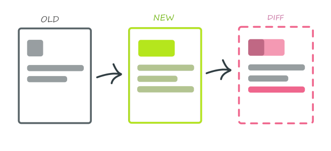

## Trabajo Individual

# Informe sobre pruebas de Regresión Visual - Demo con BackstopJS

## Desarrollo Conceptual

En la actualidad existen una gran cantidad de dispositivos en los que se pueden ejecutar aplicaciones, ya sea en una computadora, teléfono celular o incluso una televisión, y cada uno de ellos puede contar con una escala de elementos diferente, lo que puede dificultar el tener una calidad visual constante. Por esta razón, es necesario que al momento de desarrollar una aplicación, se tenga que verificar que la interfaz se vea bien sin importar la orientación, escala o el ratio de la pantalla.

Hacer esa tarea manualmente puede llegar a ser muy tedioso, ya que implica verificar una gran variedad de vistas y asegurarse de que se visualicen adecuadamente en diversos dispositivos. Además, el desarrollo visual es un proceso constante, teniendo actualizaciones frecuentes en la interfaz, nuevas secciones, funciones o componentes, lo que puede afectar el aspecto visual de la interfaz de usuario. Por estas razones es que existen las pruebas de regresión visual, que permiten detectar errores o inconsistencias visuales antes de que la página se publique.

### Pruebas de Regresión Visual

En primer lugar, se tiene que entender que las pruebas de regresión aseguran que una actualización de software no dañe algo que ha estado funcionando correctamente. Por otro lado, las pruebas de regresión _visual_ son un tipo de prueba automatizada diseñada para detectar diferencias en la interfaz de usuario de una aplicación cuando se realizan cambios en el código.

### ¿Cómo funcionan las pruebas de regresión visual?

Las pruebas de regresión visual se enfocan en la apariencia y en cómo se presenta la información al usuario. Estas pruebas comparan capturas de pantalla del estado actual de la aplicación con imágenes de referencia (mockups), identificando errores, discrepancias o defectos como cambios en colores, tamaños, alineaciones o posiciones de los elementos.

El objetivo de las pruebas de regresión visual son:

- **Detectar discrepancias visuales.** Se identifican fallos visuales en la interfaz, como elementos desalineados, estilos rotos o componentes faltantes.
- **Automatizar la revisión visual de la interfaz.** Estas pruebas facilitan la detección de defectos en una gran cantidad de vistas de forma automática.
- **Validar el diseño en múltiples entornos.** Además, permiten verificar que la aplicación se renderiza correctamente en diferentes navegadores y dispositivos.

### Limitaciones

A pesar de sus beneficios las pruebas de regresión visual, como cualquier herramienta tecnológica, tienen sus limitaciones

- **Configuración inicial.** La configuración de herramientas y flujos de pruebas pueden ser complejas y requerir tiempo.
- **Falsos positivos y falsos negativos.** Dependiendo de la sensibilidad, pequeñas diferencias en el renderizado de la interfaz pueden ser reportadas como errores o no. Estos los resultados pueden comprometer la fiabilidad de estas pruebas
- **Alto consumo de recursos.** Las capturas de pantalla y comparaciones pueden requerir almacenamiento significativo y potencia computacional. Además, se necesita un buen ancho de banda al probar un gran número de páginas web, escenarios y variaciones.

### ¿Por qué usar pruebas de Regresión Visual?

Más allá de que una aplicación sea completamente funcional, uno de los aspectos más importantes al momento de desarrollar un software es el crear una interfaz fácil de usar, que no confunda al usuario final. Sin embargo, como se ha mencionado a lo largo del informe, las interfaces gráficas pueden mostrarse diferentes dependiendo de variables como la resolución, la orientación, la configuración y el tipo de dispositivo del usuario. Estos factores, aunque parezcan minúsculos, pueden provocar serios cambios no deseados en el diseño o funcionalidad de la aplicación, afectando la experiencia del usuario.

Debido a estas razones, se recomienda el uso de pruebas de regresión visual para detectar y solucionar problemas antes de desplegar el software a los usuarios, garantizando su calidad visual en la mayoría de los escenarios.

Puntualmente, implementar pruebas de regresión visual aporta las siguientes ventajas:

- **Garantía de calidad visual.** Aseguran que los cambios en el código no afecten negativamente la interfaz de usuario y su usabilidad.
- **Evita la realización de pruebas manuales.** Las herramientas que realizan estas pruebas lo hacen automáticamente, permitiendo que los equipos se concentren en tareas más importantes.
- **Consistencia en múltiples dispositivos.** Garantizan que la experiencia visual de la aplicación sea consistente en diferentes dispositivos.
- **Prevención de errores en producción.** Identifican problemas antes de que afecten a los usuarios finales, protegiendo la reputación del producto y la empresa.

### Algunas herramientas para regresión visual

Existen diversas herramientas disponibles para desarrollar pruebas de regresión visual. Hay herramientas que son desde simples extensiones de navegador hasta complejas plataformas basadas en la nube.

- **Percy:** Una plataforma basada en la nube que se puede integrar con diversos frameworks de prueba. Automatiza y proporciona un panel visual para revisar y aprobar los cambios en las interfaces probadas.
- **BackstopJS:** Una herramienta de código abierto, basada en nodos que captura y compara capturas de pantalla, generando informes interactivos en HTML con las diferencias encontradas.
- **Applitools:** Esta herramienta aplica IA que identifica diferencias en capturas de pantalla para detectar errores visuales. Además, cuenta con una plataforma web para mostrar los resultados obtenidos.
- **Espectro:** Una herramienta basada en ruby que utiliza PhantomJS o SlimerJS para capturar y comparar capturas de pantalla, y genera una galería de imágenes con superposiciones de diferencias.
- **Cypress:** Utilizando la extensión de cypress-image-snapshot, esta herramienta de pruebas permite integrar pruebas de regresión visual a la par que sus pruebas funcionales.

## Consideraciones Técnicas

Para la demostración, se hará uso de BackstopJS para conocer los cambios de estructura y diseño dentro de una página web. Como su nombre indica, el backstop utiliza el lenguaje de programación JavaScript por lo que se necesitará tener instalado Node.js y npm. Se puede instalar la última versión LTS de Node.js para tener lo necesario desde su página oficial.

Revise que tiene node y npm al revisar la versión de ambos, de dar error indica que hubo un error de instalación o similar.

node -v

npm -v

BackstopJS se puede instalar de forma global para que este paquete pueda ser usado en cualquier proyecto web que tengas. Corriendo el siguiente código lo instalarás globalmente:

npm install -g backstopjs

Una vez tengas instalado el paquete BackstopJS en tu computadora, puedes inicializar Backstop en el proyecto que prefieras, esto utilizando el siguiente comando:

backstop init

Por defecto, se crean diversos archivos dentro de tu proyecto, incluyendo archivos de Playwright y Puppeteer. Además, crea el archivo de configuración “backstop.json” en el que debes especificar las dimensiones de las vistas que quieres probar (viewports) para poder iniciar el proceso de comparación. En el mismo archivo puedes colocar los escenarios (scenarios) que indique la url de las páginas que Backstop debe probar.

Utilizando el siguiente comando, permite tomar capturas de las páginas expuestas en los escenarios, para poder usarlas como punto de comparación con los próximos cambios que hagas.

backstop reference

Cuando haya terminado el proceso de tomar bitmaps de referencia, se utiliza el comando test para comparar los cambios de diseño que se hayan realizado con la referencia. Después de haber ejecutado el comando, Backstop creará un informe HTML en el que mostrará visualmente las diferencias.

backstop test

En caso el diseño haya cambiado y realmente los cambios son correctos conforme a lo que se intenta estructurar en la página, se utiliza el comando approve para indicar a backstop que la versión actual de las páginas las tome como nuevas referencias.

backstop approve

## Demostración

Para la demostración se tuvo una plataforma web desarrollada en React JS y se mostrará cómo funciona BackstopJS al cambiar variables de diseño CSS de la plataforma web.

\[URL DEL VIDEO\]

## Referencias

Linkedin. (s.f.). _¿Qué son las pruebas de regresión visual?._ <https://es.linkedin.com/advice/3/what-visual-regression-testing-skills-web-development-pl1vf?lang=es>

QAlified. (2023). _Introducción a las Pruebas de Regresión Visual: Una Guía Sencilla._ <https://qalified.com/es/blog/pruebas-regresion-visual/>

Linares-Vásquez, M., & Escobar-Velásquez, C. (2020). _Pruebas de regresión para interfaces._ Recuperado de la Universidad de los Andes, Bogotá, Colombia. <https://miso-4208-labs.gitlab.io/book/chapter6/pruebas-de-regresion-para-interfaces.html>

Lau, L. (2024). _What Is Regression Testing: Examples, Tools and Best Practices._ Valido. <https://www.valido.ai/es/pruebas-de-regresion/>