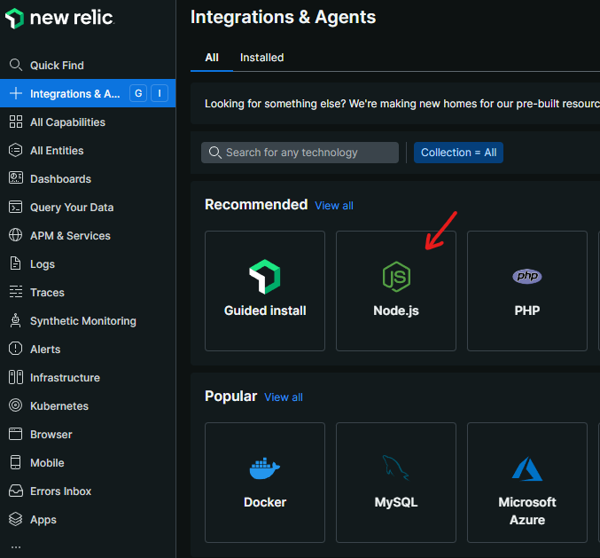
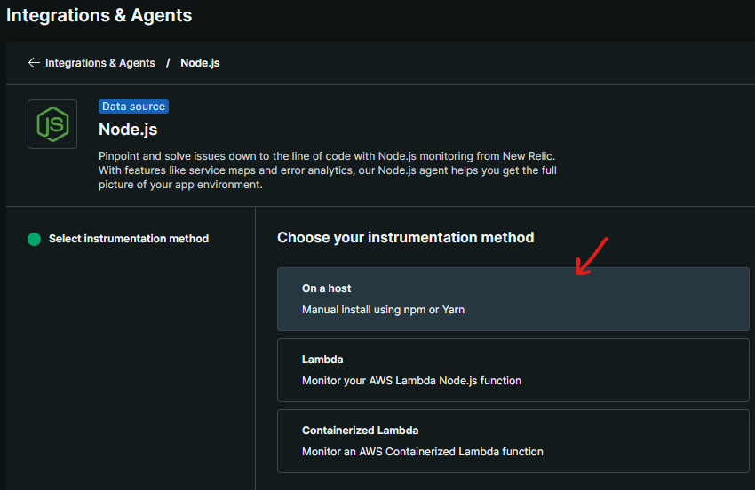
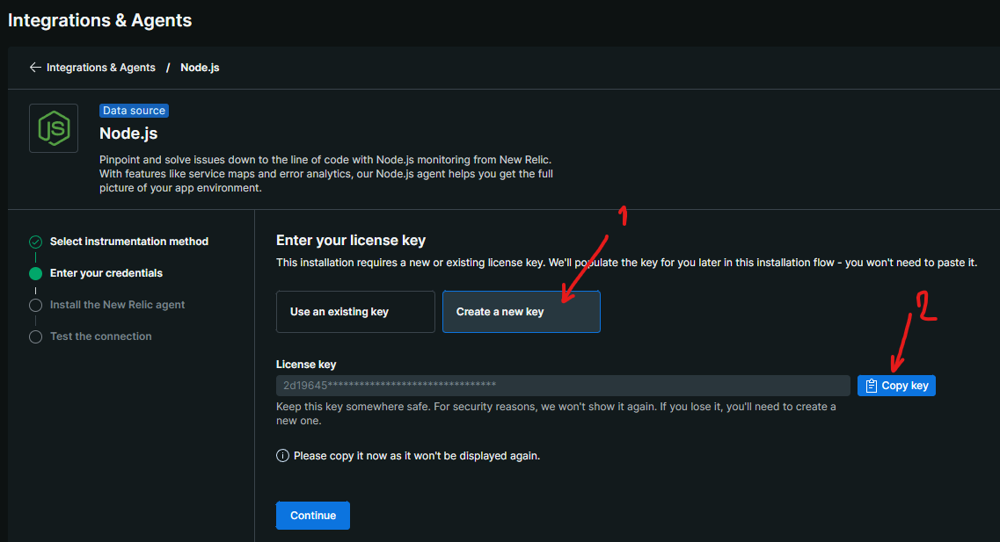
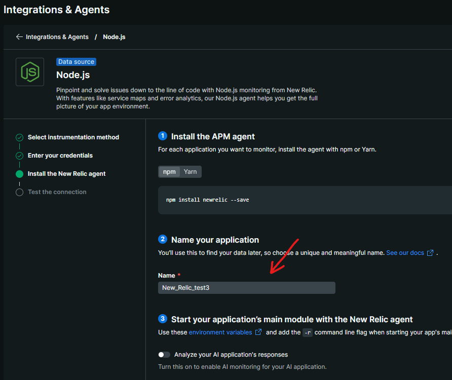
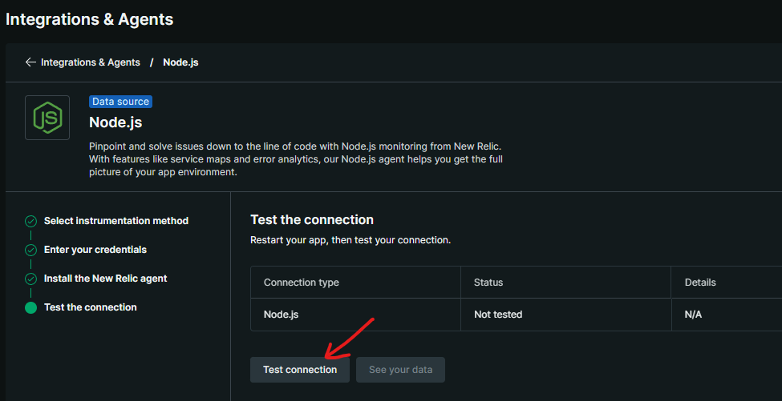
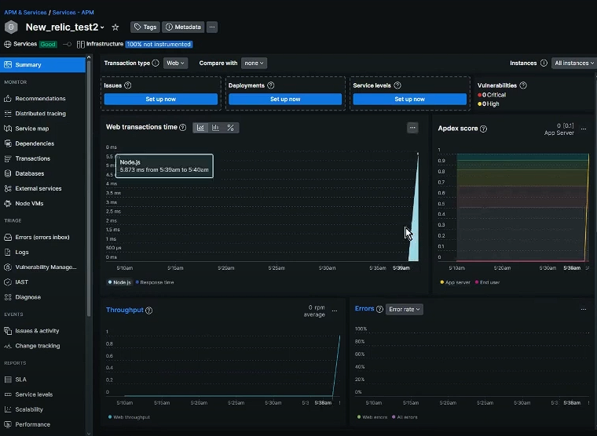

# Observabilidad y Monitoreo: New Relic, Prometheus y Sentry
## 1. Desarrollo Conceptual
La observabilidad y el monitoreo son componentes críticos en la arquitectura de software moderna, particularmente en sistemas distribuidos y microservicios. A través de estos, las organizaciones pueden rastrear el rendimiento, identificar problemas y mantener la estabilidad de sus sistemas. Vamos a explorar tres soluciones principales de observabilidad: New Relic, Prometheus, y Sentry, destacando sus enfoques y capacidades.

### New Relic
New Relic es una plataforma de observabilidad SaaS (Software as a Service) que recolecta datos de las métricas seleccionadas durante el procesamiento de las pruebas de la aplicación, ya que, además de los agentes que realizan la captura y recolección de datos de procesamiento de las aplicaciones objetivo, la herramienta también proporciona un portal para la visualización en tiempo real y el monitoreo de las aplicaciones durante el procesamiento, además de almacenar los datos recolectados para análisis futuros.

### Prometheus
Prometheus es una herramienta de monitoreo de código abierto diseñada para recolectar métricas de servicios y dispositivos, y almacenar estos datos en una base de datos de series temporales. Destaca en la monitorización de microservicios y sistemas distribuidos, ya que se integra fácilmente con Kubernetes y otros orquestadores de contenedores. Utiliza un modelo pull, donde Prometheus se conecta a los servicios para obtener métricas.

### Sentry
Sentry es una plataforma centrada en el monitoreo de errores en el código de aplicaciones. Se especializa en la detección y reporte de excepciones, ayudando a los desarrolladores a identificar y corregir errores en el código. Es ideal para detectar problemas a nivel de cliente (front-end) y servidor (back-end), proporcionado contexto detallado sobre los errores que ocurren en producción.

## 2. Consideraciones Técnicas
Cada una de estas herramientas tiene requisitos técnicos específicos que se deben tener en cuenta al implementarlas.

### New Relic:
Configuración: Requiere la integración de un agente específico según el lenguaje de programación utilizado. Para Node.js, se instala el paquete newrelic y se configura el archivo newrelic.js con las claves de API y otros parámetros de monitoreo.
Datos recolectados: New Relic proporciona datos sobre tiempos de respuesta, utilización de CPU, errores y tráfico. También incluye trazabilidad distribuida para aplicaciones que utilizan múltiples servicios y bases de datos.
Instalación: Se debe instalar el agente de New Relic en el servidor de aplicaciones o dentro de un contenedor Docker, y configurarlo para que envíe métricas a la plataforma de New Relic.
### Prometheus:
Configuración: Requiere un archivo de configuración YAML en el que se definen los endpoints que Prometheus debe monitorear. Prometheus se integra fácilmente con servicios como Kubernetes y Docker para obtener métricas de rendimiento de los contenedores.
Instalación: La instalación de Prometheus generalmente se realiza a través de Docker o directamente en servidores. Se recomienda también utilizar un stack complementario como Grafana para visualizar las métricas recolectadas.
### Sentry:
Configuración: Al igual que New Relic, Sentry requiere un agente que se instala en la aplicación. Se configura mediante un token de acceso y permite rastrear errores en tiempo real.
Datos recolectados: Sentry captura excepciones, incluyendo el contexto de la ejecución, lo que permite ver el stack trace, el estado de las variables en el momento del error, y otros detalles clave.

### Comparación:
New Relic, Prometheus y Sentry son herramientas poderosas que cubren diferentes aspectos de la observabilidad y el monitoreo. Mientras que New Relic ofrece un enfoque completo para aplicaciones y su infraestructura, Prometheus sobresale en la monitorización de microservicios y Sentry proporciona visibilidad específica sobre los errores en el código. Cada herramienta aporta un valor único, y su elección depende de los requisitos específicos del sistema que se esté desarrollando o monitoreando.
# 3. Demo: Implementación de New Relic en Node.js
A continuación, vamos a implementar un ejemplo básico utilizando New Relic en una aplicación de Node.js.

## Pasos de creación de aplicación en la plataforma de New Relic
### Paso 1

### Paso 2

### Paso 3

### Paso 4

### Paso 5 : Hacer este paso luego de iniciar la aplicación en Node.js

## Pasos de instalación y configuración de forma local:
Instalación de New Relic: Primero, debemos instalar el paquete de New Relic en el proyecto de Node.js:

```
npm install newrelic
```
Posteriormente se debe crear un archivo llamado **newrelic.js** con el siguiente formato: 
Para obtener el Licensekey volver al paso 3 de los pasos anteriores
Para obtener el App_name volver al paso 4 de los pasos anteriores
```
exports.config = {
  app_name: ['Mi Aplicación Node.js'],
  license_key: 'YOUR_NEW_RELIC_LICENSE_KEY',
  logging: {
    level: 'info'
  },
};
```

Importar New Relic en el código de la aplicación: El siguiente paso es asegurarse de que New Relic se cargue al iniciar la aplicación. Esto se realiza simplemente agregando la línea de código al inicio del archivo app.js o index.js de tu aplicación Node.js:
  
```
app.get('/', (req, res) => {

    newrelic.noticeError(new Error('Este es un log personalizado en la ruta principal'));
  
    res.send('Hola, New Relic está monitoreando esta aplicación.');
  });
```

Ejecución de la aplicación: Al ejecutar la aplicación con node app.js, New Relic comenzará a recopilar datos y los enviará al dashboard de New Relic. Puedes monitorear las métricas directamente desde el panel de control de New Relic.



#### Publicación del código:
https://github.com/veilhdmi/New_relic_test
#### Video de Demo:
https://www.youtube.com/watch?v=BExtxRqGFm0
### Referencias:

Janes, A., Li, X., & Lenarduzzi, V. (2023). Open tracing tools: Overview and critical comparison. The Journal of Systems & Software, 204, 111793. https://doi.org/10.1016/j.jss.2023.111793

Amazon Web Services. (s. f.). The difference between monitoring and observability. AWS. Recuperado el 10 de octubre del 2024, de https://aws.amazon.com/es/compare/the-difference-between-monitoring-and-observability/

ProjectPro. (s. f.). New Relic vs Prometheus: A detailed comparison. Recuperado el 10 de octubre del 2024, de https://www.projectpro.io/compare/new-relic-vs-prometheus