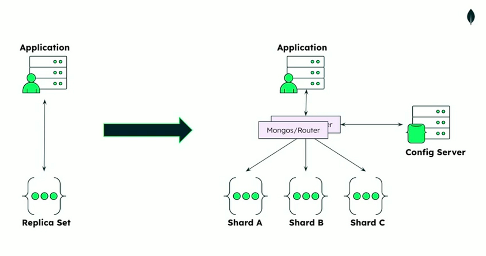
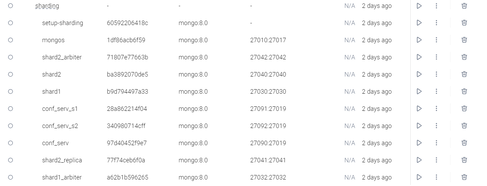

# Patrón Sharding

En primer lugar, el problema que se busca resolver es el de la escalabilidad y el rendimiento en bases de datos, ya que al dividirlas en distintas particiones más pequeñas y manejables se puede dividir la carga de trabajo al recibir una menor cantidad de transacciones, a diferencia de una arquitectura totalmente monolítica que recibe todas las transacciones de todos los módulos. En ese caso, los servidores se pueden sobrecargar al recibir una gran cantidad de transacciones, haciendo que sus recursos no sean suficientes.

La solución es la de dividir estos almacenes de datos de manera horizontal para mejorar el rendimiento por la distribución de la carga de las transacciones. En este caso, las particiones deben de tener un mismo esquema. Asimismo, se usan distintas estrategias como:

- **Lookup**: Utiliza un mapa para dirigir las solicitudes al fragmento correcto.

 

- **Range**: Agrupa elementos relacionados en el mismo fragmento y los ordena por clave de fragmento.

 

- **Hash**: Distribuye los datos uniformemente para evitar puntos calientes.

 

## Escenarios

- **Comercio electrónico**: Al manejar grandes volúmenes de productos, se producen muchas transacciones de envío y gestión. Por ello, se usa este patrón para dividir las transacciones en distintos módulos como catálogo de productos y órdenes de compra.

- **Redes sociales**: Al manejar grandes cantidades de datos de los usuarios, se implementa sharding basándose en el tipo de contenido como fotos, videos, redacciones e incluso mensajes. De esta forma, se dividen estos módulos para darle una mejor disponibilidad a los datos de cada usuario.

## Aplicación en el trabajo grupal

Esta es una gran opción para mejorar la disponibilidad de los datos del proyecto. Se pueden generar instancias de particiones de la base de datos y utilizar contenedores que creen particiones distintas para fragmentar la información y mejorar la disponibilidad.

En este caso se va a aplicar la estrategia de hash para que distribuya los datos de manera uniforme; es decir, que al estar hasheada la id de los documentos en el shard se puede ordenar de a todos estos documentos de la misma manera. Esto ayuda bastante a que el sistema ordene rapido los documentos en los nodos shard.

Asimismo, a cada shard se le va a aplicar la tecnica de replicación para que la información que entre al nodo primario del shard se pueda almacenar en otros nodos secundarios. Estos nodos secundarios servirán por si acaso el primario llega a caer.

También, se va a utilizar un router que servirá como conector entre el cliente y los shard1. Este nodo (mongos) va a determinar donde guardar el documento creado. Además, se tiene un server de configuracion que va a ayudar al cluster/router a determinar donde se deberia guardar la data.

Se va a utilizar contenedores de docker para simular la situacion en la que se tienen distintos servidores de shards. Se tiene también un contenedor setup que va a ayudar a configurar tanto los shards, el server de configuración y el router mongos.

También, para comprobar la conexión de toda la arquitectura se usan los microservicios que al iniciarlos van a indicar en los los en el puerto en el que escuchan.

A partir de aquí se realizaría la llamada api para poder realizar un post, get, delete o update en el sistema de su preferencia, pero siguiendo las rutas especificadas en el microservicio.

### Link del codigo de la demo
[Link del repositorio con la demo](https://github.com/Seboot2002/booking-rest-api-express-mongodb)