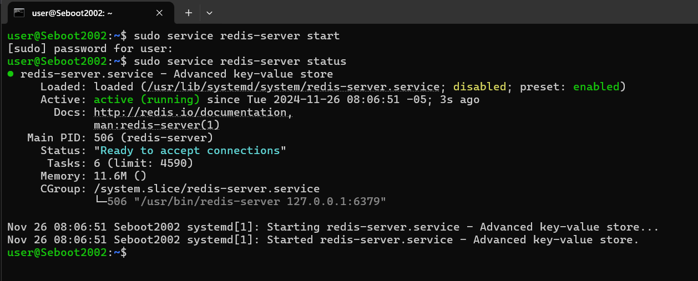
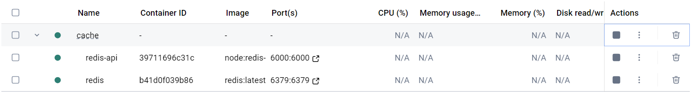
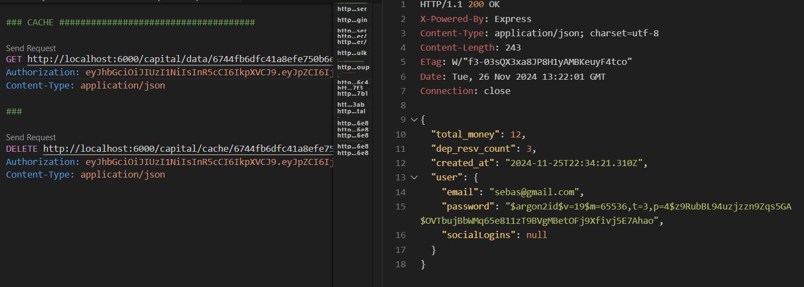

# Estrategias de Consistencia de Caché

Las estrategias de consistencia de caché son técnicas utilizadas para garantizar que los datos almacenados en la caché estén sincronizados con la base de datos o cualquier otra fuente de datos persistente. Estas estrategias definen cómo se manejan las actualizaciones de datos en la caché y en la base de datos, buscando siempre mejorar el rendimiento de la aplicación sin sacrificar demasiado la consistencia.

## Tipos de Estrategias de Consistencia

### 1. **Write-Through**
En una estrategia **Write-Through**, cada vez que se realiza una escritura de datos, estos se guardan tanto en la caché como en la base de datos de manera simultánea.

- **Descripción**: La aplicación actualiza los datos en la caché, esos mismos datos se escriben inmediatamente en la base de datos. Esto garantiza que los datos en la base de datos siempre estén actualizados y reflejen lo que está en la caché.
  
- **Ventajas**: La principal ventaja de este enfoque es que asegura **consistencia** entre la caché y la base de datos, porque ambos tienen los mismos datos en todo momento. No hay riesgo de que la base de datos tenga información desactualizada respecto a la caché.

- **Desventajas**: esto puede generar mayor latencia como las escrituras deben ocurrir tanto en la caché como en la base de datos, el rendimiento de la aplicación puede verse afectado, especialmente cuando las escrituras a la base de datos son costosas o lentas. Además, hay un aumento en la carga sobre la base de datos, ya que cada escritura requiere que se realice en ambos lugares.

**Uso típico**: Se utiliza cuando la **consistencia de datos** es crucial y se puede tolerar una mayor latencia en las escrituras.

---

### 2. **Write-Behind**
La estrategia **Write-Behind** o **Write-Back** es diferente en el sentido de que cuando los datos se escriben en la caché, no se escriben inmediatamente en la base de datos. En lugar de eso, las escrituras a la base de datos se realizan de manera asincrónica, a menudo en intervalos programados.

- **Descripción**: Cuando la aplicación escribe en la caché, estos datos no se actualizan de inmediato en la base de datos. En lugar de eso, se guarda un registro de las actualizaciones y la base de datos se actualiza posteriormente, generalmente en un proceso en segundo plano. Esto permite que la base de datos no sea saturada con escrituras inmediatas y se actualice solo en momentos estratégicos.

- **Ventajas**: El principal beneficio de este patrón es el mejor rendimiento y la menor carga sobre la base de datos. Al escribir en la caché y luego enviar las actualizaciones en segundo plano a la base de datos, se pueden agrupar muchas actualizaciones en un solo proceso, lo cual es más eficiente que realizar escrituras inmediatas. Esto reduce la latencia en las operaciones de escritura.

- **Desventajas**: La principal desventaja es que existe un riesgo de inconsistencia temporal entre la caché y la base de datos. Como las actualizaciones no son inmediatas, puede ocurrir que los datos en la base de datos estén desactualizados durante un período. Además, este patrón puede ser más complejo de implementar y gestionar.

**Ejemplo**: Se utiliza cuando el rendimiento es más importante que la consistencia inmediata y cuando las actualizaciones en la base de datos no necesitan ser reflejadas de inmediato.

---

### 3. **Cache-Aside**
La aplicación decide cuándo cargar o actualizar los datos en la caché. Si los datos no están en la caché, la aplicación los busca en la base de datos, los guarda en la caché y luego los devuelve al usuario.

- **Descripción**: Esta aplicación es responsable de cargar los datos en la caché solo cuando es necesario y si los datos no están en la caché la aplicación los obtiene de la base de datos y los almacena en la caché para futuras solicitudes. Las actualizaciones de la base de datos no afectan automáticamente la caché; es la responsabilidad de la aplicación actualizar la caché cuando lo considere necesario.

- **Ventajas**: La principal ventaja de esta estrategia es su flexibilidad. La caché solo se llena con los datos que realmente se necesitan, evitando el sobrecosto de mantener grandes volúmenes de datos en memoria. También proporciona un control total sobre cuándo y cómo actualizar la caché.

- **Desventajas**: Sin embargo, este patrón puede llevar a mayor latencia en el primer acceso a los datos, ya que si la caché no tiene los datos, debe consultar la base de datos. También existe la posibilidad de inconsistencias si los datos en la base de datos cambian y la caché no se actualiza de manera oportuna.

**Ejemplo**: Se utiliza cuando los datos no se acceden de forma constante, o cuando la aplicación necesita un control completo sobre el ciclo de vida de los datos en la caché.

---

### 4. **Refresh-Ahead**
El patrón Refresh-Ahead es una estrategia que trata de prevenir cache misses y mantiene los datos frescos en la caché antes de que caduquen. En lugar de esperar a que los datos en caché se vuelvan obsoletos, la caché se actualiza proactivamente.

- **Descripción**: Con *Refresh-Ahead, los datos en la caché se actualizan de manera anticipada antes de que lleguen a su fecha de caducidad. Esto asegura que, cuando un usuario solicite esos datos, siempre encontrará la versión más reciente disponible en la caché.

- **Ventajas**: La principal ventaja es que se reduce la latencia de las solicitudes, ya que los datos siempre están disponibles en la caché. No hay necesidad de consultar la base de datos en cada solicitud, lo que mejora el rendimiento general del sistema. También mejora la disponibilidad de los datos, manteniéndolos actualizados en la caché.

- **Desventajas**: Esta estrategia puede ser costosa en términos de uso de recursos, ya que requiere que la caché se actualice constantemente, incluso cuando no hay solicitudes de datos. Además, puede ser más compleja de implementar, ya que requiere un mecanismo para anticipar cuándo se deben refrescar los datos.

**Ejemplo**: Se utiliza en aplicaciones donde la disponibilidad y rendimiento son más críticos que el uso de recursos, y donde es necesario que los datos siempre estén disponibles y actualizados en la caché.

---

## Resumen de Estrategias de Consistencia de Caché

| **Patrón**        | **Descripción** | **Ventajas** | **Desventajas** |
|-------------------|-----------------|--------------|-----------------|
| **Write-Through** | Los datos se escriben en la caché y en la base de datos al mismo tiempo. | Consistencia garantizada, simple. | Mayor latencia, mayor carga sobre la base de datos. |
| **Write-Behind**  | Los datos se escriben primero en la caché y luego de forma asincrónica en la base de datos. | Mejor rendimiento, menos carga sobre la base de datos. | Riesgo de inconsistencia temporal, mayor complejidad. |
| **Cache-Aside**   | Los datos se cargan en la caché solo cuando es necesario. | Flexibilidad, control total sobre la caché. | Mayor latencia inicial, posible inconsistencia si no se actualiza la caché. |
| **Refresh-Ahead** | Los datos se actualizan proactivamente antes de que caduquen. | Menor latencia, caché siempre actualizada. | Uso de recursos, mayor complejidad. |

---

### Aplicación dentro del proyecto

Se debe activar un servicio en Windows o Linux. En este caso redis solo funciona con linux, 
pero si deseas usar windows se puede usar la extension wsl que se instala con el comando.

```
wsl --install
```

Luego, puedes instalar el servicio de redis y activarlo para que puedas acceder a un cliente.



Aunque en este caso de va a realizar en contenedores docker; por lo que, ya se instala una instancia de redis y otra la cual de manera modular se va a ir desarrollando un api para la administracion del cache.



En este caso se implementó la estrategia **Cahe-Aside**. Por eso, al momento de que se accede al cache se intenta obtener la data de la base de datos de capital, entonces si no encuentra el dato que se desea en el cache va a crear el dato dentro de cache para que cuando se vuelva a acceder se haga la mitad de rapido a comparación de acceder a la base de datos de manera normal.



### Link del código de la demo
En este repositorio se utiliza la carpeta "microservice-arquitecture".

[Link del repositorio con la demo](https://github.com/Seboot2002/booking-rest-api-express-mongodb)

# Acceso al video
[Link del video de presentación](https://www.youtube.com/watch?v=o81U9q_Fnpw)