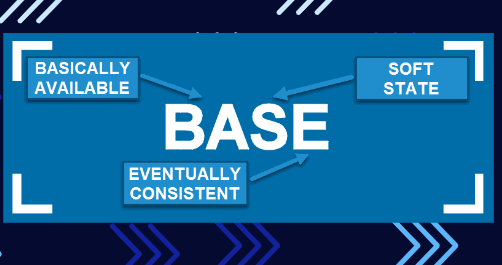
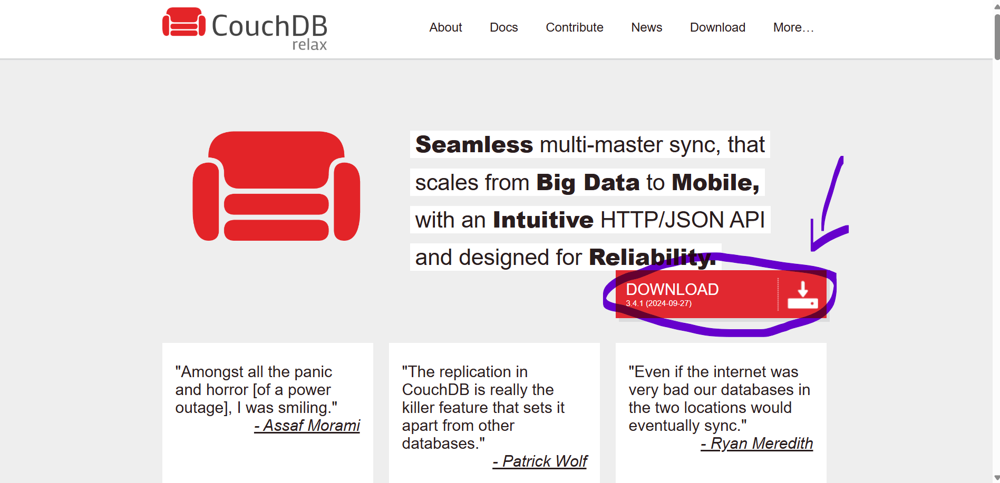
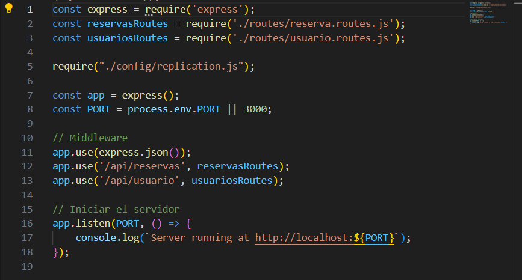

# Bases de Datos NoSQL

Este tipo de bases de datos utilizan documentos como unidad de almacenamiento siendo tanto JSON o BSON. Estos se diferencian de las bases de datos SQL, ya que no utilizan tablas con filas y columnas. Su estructura se basa en tener distintas colecciones que actúan como contenedores de los documentos, los cuales pueden compartir características o contextos.

Existen distintos modelos que se pueden implementar, como el modelo BASE (Basically Available, Soft State, Eventual Consistency), que indica que se puede obtener la data fácilmente; es decir, que tiene buena disponibilidad. Además, los estados de los documentos pueden cambiar con el tiempo y eventualmente todos los nodos o documentos tendrán una misma estructura no inmediatamente, pero sí después.



## Diferencias en el Uso de NoSQL

Unos ejemplos de proyectos que se pueden implementar con bases de datos NoSQL incluyen:
- Aplicaciones de comercio electrónico
- Aplicaciones de lectura
- Motores de recomendación que requieren manejar grandes volúmenes de datos
- Aplicaciones de mensajería
- Blogs
- Sistemas de gestión de contenido

Estos ejemplos comparten la característica de que implementan datos de manera dinámica; es decir, que no siguen una estructura fija. A diferencia de:
- Sistemas financieros o contables
- Sistemas ERP
- Gestión de productos

Estos últimos requieren una estructura fija y relaciones establecidas para asegurar la integridad de los datos y la consistencia en sus transacciones (ACID).

# Base de Datos CouchDB

CouchDB es una base de datos NoSQL open source que utiliza el modelo de almacenamiento de documentos en formato JSON y se gestiona a través de una API RESTful. Su arquitectura se centra en la replicación continua y automática. Esto facilita la sincronización de datos entre múltiples instancias siendo ideal para aplicaciones distribuidas. CouchDB es conocida por su eficiente manejo de conflictos asegurando la consistencia eventual en entornos con múltiples copias de datos.

## Ventajas y Desventajas de CouchDB

### Ventajas:
- La replicación es continua y automática. Esto permite crear copias de seguridad y sincronizar datos entre servidores fácilmente.
- La replicación y el manejo de conflictos permiten que la base de datos se mantenga disponible incluso en situaciones de red inestable o caída de servidores.

### Desventajas:
- No es adecuada para operaciones que requieren múltiples relaciones y consultas complejas.

# Demostración de Demo

A continuación, se muestra una demo de cómo se implementaría CouchDB con una API en Express.

**Link de descarga de la base de datos:** [CouchDB](https://couchdb.apache.org/#:~:text=Apache%20CouchDB%20%E2%84%A2%20lets%20you%20access)



## Installation

1. Descargue el Api.
2. Instala las dependencias:

    ```bash
    npm install
3. Enciende el API:

    ```bash
    npm run start


4. Si todo sale bien saldrá el mensaje de que se ha conectado al puerto 3000.
# Acceso al video
[Link del video de presentación](https://youtu.be/8IygZxEVQVE)
