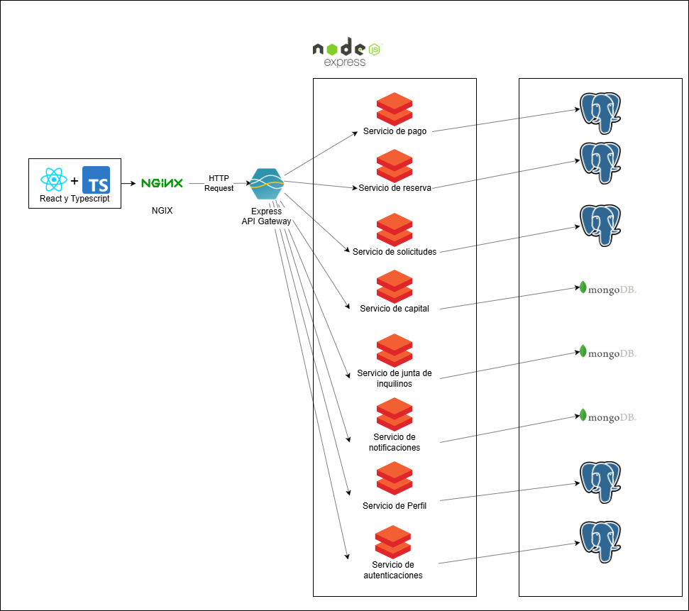

# 3.4. Mapeo entre elementos de Arquitectura
# Decisiones de Mapeo

## 1. Decisión sobre el Mapeo entre Módulos y Servicios
**Contexto**: El sistema contiene varios módulos clave (pagos, reservas, solicitudes, notificaciones, etc.) que serán desplegados como servicios individuales. Esto permitirá mayor escalabilidad y flexibilidad, dado que cada servicio puede evolucionar de manera independiente.

**Alternativas**:
- **Múltiples módulos en un solo servicio**:
  - Ventajas: Menor complejidad de despliegue.
  - Desventajas: Menor flexibilidad y escalabilidad.
- **Un servicio por módulo**:
  - Ventajas: Mayor independencia y escalabilidad para cada módulo.
  - Desventajas: Incrementa la complejidad operativa.

**Criterios de Elección**:
- Necesidad de escalabilidad e independencia de cada módulo.
- Capacidad para implementar cambios sin afectar a otros módulos.

**Decisión**: Se elige desplegar **un servicio por módulo**. Cada módulo (pagos, reservas, solicitudes, notificaciones, etc.) se convertirá en un servicio independiente. Esto maximiza la capacidad de escalar cada módulo según las necesidades y facilita la implementación de cambios sin afectar a otros módulos.

## 2. Decisión sobre el Mapeo entre Elementos de Software y Unidades de Ejecución
**Contexto**: Todos los servicios individuales deben asignarse a unidades de ejecución (servidores o contenedores) que permitan escalabilidad y robustez.

**Alternativas**:
- **Despliegue en contenedores Docker**:
  - Ventajas: Facilita el despliegue, portabilidad y escalabilidad.
  - Desventajas: Mayor complejidad operativa para gestionar múltiples contenedores.
- **Despliegue en máquinas virtuales (VMs)**:
  - Ventajas: Aislamiento y seguridad por servicio.
  - Desventajas: Menor flexibilidad y escalabilidad.

**Criterios de Elección**:
- Necesidad de consistencia entre entornos.
- Facilidad de replicación y escalado de servicios.

**Decisión**: Se elige desplegar **todos los servicios individuales en contenedores Docker**. Esto garantiza consistencia entre los entornos y facilita la replicación y el escalado de cada servicio de manera independiente.

## 3. Decisión sobre el Mapeo entre el Modelo de Datos y los Almacenes Físicos de Datos
**Contexto**: El sistema usa tanto bases de datos relacionales (PostgreSQL) como no relacionales (MongoDB), y cada servicio debe asignarse a la base de datos más adecuada según sus necesidades.

**Alternativas**:
- **PostgreSQL para todos los servicios**: Integridad referencial y estructura.
- **MongoDB para servicios con esquemas más dinámicos**: Flexibilidad y rapidez para datos semiestructurados.

**Criterios de Elección**:
- Necesidad de integridad referencial en ciertos servicios.
- Flexibilidad en el manejo de datos semiestructurados.

**Decisión**: Los servicios de **pagos y reservas** utilizarán **PostgreSQL** por su necesidad de integridad referencial, mientras que **notificaciones y capital** se almacenarán en **MongoDB** por su flexibilidad para manejar esquemas cambiantes.

## 4. Decisión sobre el API Gateway
**Contexto**: El sistema requiere una puerta de enlace (API Gateway) para gestionar el enrutamiento y la seguridad entre los múltiples servicios (pagos, reservas, solicitudes, etc.). Esta capa es crucial para manejar las solicitudes externas, controlar el tráfico y centralizar la autenticación.

**Alternativas**:
- **Kong API Gateway**:
  - Ventajas: Potente y extensible, con muchas características predefinidas.
  - Desventajas: Requiere más tiempo de configuración y aprendizaje.
- **NGINX como API Gateway**:
  - Ventajas: Altamente configurable y con buen rendimiento.
  - Desventajas: Menos soporte para microservicios de manera nativa.
- **Express API Gateway**:
  - Ventajas: Simple, fácil de integrar con Node.js, y permite una mayor personalización.
  - Desventajas: No incluye tantas características predefinidas como otras soluciones especializadas.

**Criterios de Elección**:
- Facilidad de integración con el entorno de Node.js.
- Necesidad de personalización para ajustarse a las necesidades del sistema.

**Decisión**: Se elige **Express API Gateway** por su simplicidad y su fácil integración con el entorno de Node.js, que ya está siendo utilizado en varios servicios. Esto permite una personalización más ajustada a las necesidades del sistema y un desarrollo ágil, dado que el equipo ya tiene experiencia con Express.

## Front-end: React + TypeScript
React + TypeScript sería la interfaz de usuario y la lógica por parte del cliente. Los usuarios podrán interactucar con la aplicación mediante esta, que envía solicitudes HTTP al back-end a través el API Gateway.
## API Gateway: Express API Gateway
AWS API Gateway actúa como el punto de entrada para todas las solicitudes que vienen del frontend. Este componente distribuye las solicitudes a los microservicios correspondientes.
## Microservicios
### Servicio de Pago:

Responsable de gestionar transacciones financieras. Este servicio interactúa con la base de datos MongoDB para registrar y recuperar datos relacionados con las transacciones.
En la versión completa, se conectaría a las pasarelas de pago (Izipay, Culqui, BCP) a través de sus respectivas API REST.
### Servicio de Reserva:

Gestiona las reservas de los departamentos. El servicio interactúa con MongoDB para almacenar y consultar la disponibilidad de los departamentos y los detalles de las reservas.
### Servicio de Solicitudes:

Gestiona las solicitudes realizadas por los usuarios, como pedidos de mantenimiento o servicios adicionales. Los datos relacionados con estas solicitudes se almacenan en MongoDB.
### Servicio de Capital:

Monitorea y gestiona los aspectos financieros, como los reportes y análisis de los gastos. Este servicio se comunica con MongoDB para almacenar y consultar datos financieros.
### Servicio de Junta de Inquilinos:

Facilita la comunicación entre los inquilinos mediante chat o videollamadas. Este servicio se conecta con MongoDB para almacenar la información de los grupos y las interacciones.
### Servicio de Notificaciones:

Encargado de enviar notificaciones a los usuarios. Las notificaciones pueden ser sobre pagos realizados, actualizaciones de reservas o cualquier otro evento importante. El Servicio de Notificaciones está conectado a Nodemailer para enviar correos electrónicos.
## MongoDB
Cada microservicio tiene su propio acceso a MongoDB, lo que le permite realizar operaciones CRUD (crear, leer, actualizar y eliminar) en la base de datos según su funcionalidad específica (reservas, pagos, solicitudes, etc.).
## Nodemailer
Nodemailer es utilizado por el Servicio de Notificaciones para gestionar el envío de correos electrónicos a los usuarios. El servicio de notificaciones procesa eventos como una nueva reserva o una confirmación de pago y, a través de Nodemailer, envía notificaciones por correo electrónico.
## Flujo General:
El usuario interactúa con la interfaz de React + TypeScript, lo que genera solicitudes HTTP que son enviadas al API Gateway.
El API Gateway distribuirá esas solicitudes a los microservicios:
El Servicio de Pago interactúa con MongoDB y eventualmente con APIs pasarelas de pago externas.
El Servicio de Reserva actualiza o consulta la disponibilidad de los departamentos en MongoDB.
El Servicio de Notificaciones utiliza Nodemailer para enviar correos electrónicos según sea necesario.
MongoDB actúa como la base de datos centralizada para todos los servicios, almacenando datos relevantes para cada uno.
