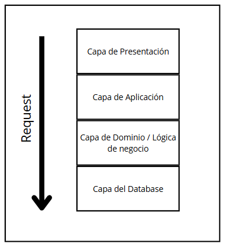

# 7.1. Patrones de Módulo

## Arquitectura en capas

### Visión general

---

### Elementos

### 1. Capa de Presentación (Interfaz de Usuario)

#### Contenido:
- **Interfaz de usuario web** como en tecnologías de React, NodeJs y Docker.
- **Adaptadores** para interactuar con las APIs REST.

#### Funciones:
- Muestra la interfaz visual de las funcionalidades del sistema.
- Valida y envía solicitudes al backend según lo que el usuario interactúa en la interfaz.

### 2. Capa de Aplicación

#### Contenido:
- **Servicios que coordinan la lógica empresarial.**
- **Adaptadores** para transformar los datos que entran y salen.

#### Funciones:
- Gestiona la interacción entre la presentación y la lógica de negocio.
- Aplica reglas de validación, seguridad y organiza el flujo de datos.

### 3. Capa de Dominio (Lógica de Negocio)

#### Contenido:
- **Entidades de negocio**, como Propiedad, Inquilino, Junta, etc.
- **Servicios de dominio** que implementan lógica compleja.
- **Casos de uso**, que agrupan procesos clave y operaciones importantes.

#### Funciones:
- Implementa la lógica de negocio principal.
- Define reglas y validaciones específicas para el dominio del sistema.

### 4. Capa de Base de Datos

#### Contenido:
- Conexiones directas a bases de datos relacionales (PostgreSQL) o NoSQL (MongoDB).
- Scripts y procedimientos almacenados necesarios para optimizar procesos.
- Configuraciones específicas del motor de base de datos como índices y particiones.

#### Funciones:
- Gestiona el acceso a la base de datos y la ejecución de operaciones CRUD.
- Realiza consultas complejas y optimiza el rendimiento a nivel de base de datos.

---

### Relaciones

#### 1. Reglas de Comunicación

- Las capas solo pueden comunicarse con la capa **inmediatamente superior** o **inferior**.
- Ejemplos:
  - La **Capa de Presentación** solo interactúa con la **Capa de Aplicación**.
  - La **Capa de Negocio** solo interactúa con las capas de **Aplicación** y **Database**.

#### 2. Diseño sin Dependencias Circulares

- La **Capa de Dominio** nunca depende de la **Capa de Aplicación** ni de la **Capa de Presentación**.
- La **Capa de Presentación** nunca interactúa directamente con la **Capa de Database**.

---

### Restricciones

#### 1. Ubicación Única

- Cada parte del software pertenece **exclusivamente** a una capa.
- Ejemplo: **Los repositorios** solo existen en la **Capa de Persistencia**.

#### 2. Mínimo de Capas

- Este diseño **incluye cuatro capas** que el requisito mínimo de dos capas. Además, se planeaba incluir una capa más de persistencia, pero no se implementó para llegar a la deadline.

#### 3. No hay Dependencias Circulares

- Las relaciones permitidas entre capas son **lineales**, sin regresar a capas superiores.
- La Capa de Base de Datos no tiene conocimiento de ninguna capa superior.
- Ejemplo de flujo permitido:  
  `Database → Dominio → Aplicación → Presentación`.

---

### Debilidades

#### 1. Más uso del rendimiento

- La interacción entre capas introduce una sobrecarga adicional como las múltiples llamadas entre capas.
- La adición de una nueva capa implica mayores costos de mantenimiento y configuración para inicializarla.