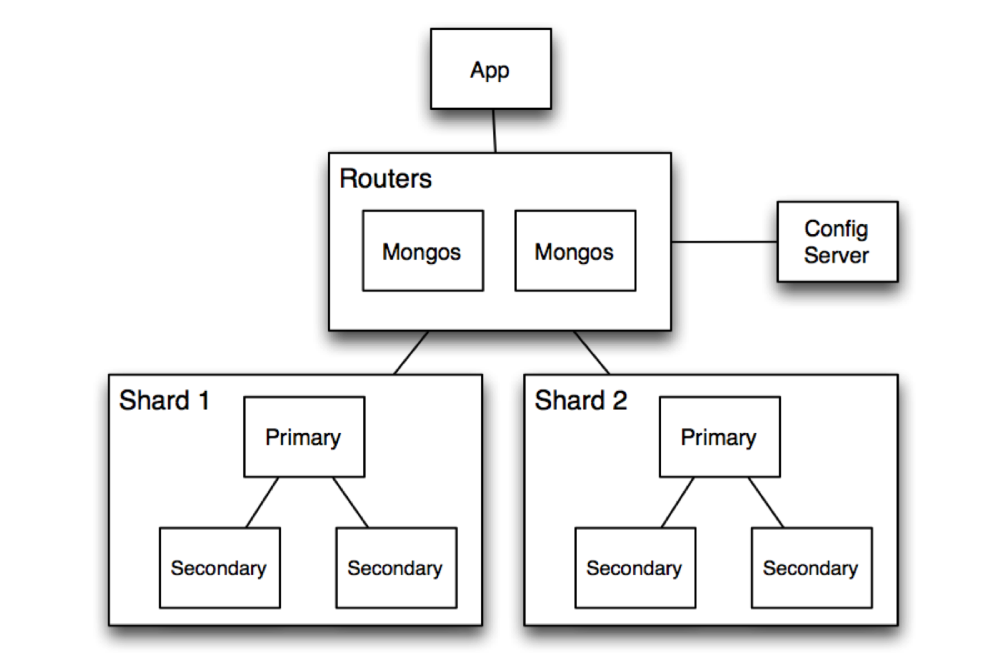

# 7.2. Patrones de Componente y Conector

# Broker

### Visión general:

---

### Elementos:

### **1. App (Aplicación)**

- Es el cliente que interactúa con la base de datos.
- Puede ser un servicio backend o una aplicación web que realiza operaciones de lectura/escritura.
- Se conecta al sistema MongoDB a través de **Mongos**, sin preocuparse por la ubicación o fragmentación de los datos.

### **2. Routers (Mongos)**

- Actúa como el *broker* (intermediario) que procesa las solicitudes de la aplicación y las redirige a los shards correspondientes.
- Encapsula la lógica de fragmentación, distribuyendo las consultas y operaciones a los nodos adecuados.
- Ofrece una interfaz unificada para la aplicación, ocultando la complejidad de la fragmentación y el escalado horizontal.

### **3. Config Server**

- Almacena metadatos sobre la distribución de datos (esquema de fragmentación).
- Es clave para que **Mongos** pueda decidir a qué shard dirigir cada solicitud.
- Se mantiene consistente a través de réplicas.

### **4. Shards**

- Son los nodos que contienen los datos distribuidos. Cada shard incluye:
  - **Primario**: El nodo principal de la réplica que gestiona las escrituras y coordina la replicación.
  - **Secundarios**: Réplicas de datos del nodo primario que permiten la recuperación ante fallos y balancean las operaciones de lectura.
- Los datos están fragmentados entre los shards, basándose en una **clave de fragmentación**.

---

### Relaciones:

### **1. App y Mongos**

- La **aplicación** envía todas las solicitudes al **Mongos**, que actúa como el intermediario entre la aplicación y los shards.
- La aplicación **desconoce** la ubicación real de los datos.

### **2. Mongos y Config Server**
- **Mongos** consulta los **Config Servers** para obtener la información sobre la distribución de los datos (fragmentación).
- Sin los **Config Servers**, **Mongos** no puede redirigir correctamente las solicitudes.

### **3. Mongos y Shards**
- **Mongos** se comunica directamente con los **shards primarios y secundarios**, enviando las operaciones a los nodos correctos según la clave de fragmentación.
- También coordina la **agregación de resultados** de múltiples shards para consultas complejas.

### **4. Config Server y Shards**
- Los **Config Servers** gestionan y actualizan la información sobre la **asignación de fragmentos** en los shards, permitiendo cambios en el esquema de fragmentación.

---

### Restricciones:

### **1. Dependencia de Mongos**
- **Mongos** es un componente crítico, ya que toda la comunicación pasa a través de él. 
- Si **Mongos** no está disponible, las operaciones de la aplicación **fallarán**.

### **2. Distribución Unidireccional**
- Las aplicaciones no interactúan directamente con los **shards** ni los **Config Servers**, sino únicamente a través de **Mongos**.
- Esto asegura una interacción controlada, pero también introduce un **único punto de falla**.

### **3. Consistencia de Config Servers**
- Los **Config Servers** deben estar **replicados** para garantizar la disponibilidad y consistencia de los metadatos.

### **4. Clave de Fragmentación**
- La elección de la **clave de fragmentación** es crítica para el rendimiento.
- Una clave mal diseñada puede causar una distribución **desigual de los datos**, resultando en **shards desbalanceados**.

---

### Debilidades:

### **Dependencia de un Punto Central (Mongos)**
- Aunque se pueden desplegar múltiples instancias de **Mongos** para alta disponibilidad, sigue siendo un punto de intermediación que puede:
  - Introducir **latencia**.
  - Representar un **cuello de botella** en sistemas de alta carga.

### **Complejidad del Config Server**
- Los **Config Servers** son fundamentales para la operación del sistema, y su fallo puede:
  - Deshabilitar la capacidad de procesar nuevas solicitudes de **fragmentación**.

### **Costo Adicional por Replicación y Fragmentación**
- La **replicación** en los shards y la gestión de los **Config Servers** añaden sobrecarga en términos de:
  - **Almacenamiento**.
  - **Complejidad operativa**.

### **Latencia en Consultas Distribuidas**
- Para consultas que requieren acceso a múltiples shards, **Mongos** debe agregar los resultados, lo que puede:
  - Incrementar la **latencia**.

---

### Fortalezas

### Escalabilidad Horizontal

- La **fragmentación (sharding)** permite distribuir datos y operaciones entre múltiples nodos (**shards**), aumentando la capacidad del sistema al agregar nuevos nodos.

### Alta Disponibilidad

- Con **réplicas** en cada shard, se garantiza la continuidad de las operaciones incluso en caso de fallos en los nodos primarios.

### Tolerancia a Fallos

- Los **Config Servers** están replicados, y cada **shard** utiliza un conjunto de réplicas, lo que asegura la recuperación ante fallos.

### Soporte para Aplicaciones de Alta Concurrencia

- La distribución de datos y consultas entre **shards** permite manejar un alto volumen de solicitudes concurrentes.