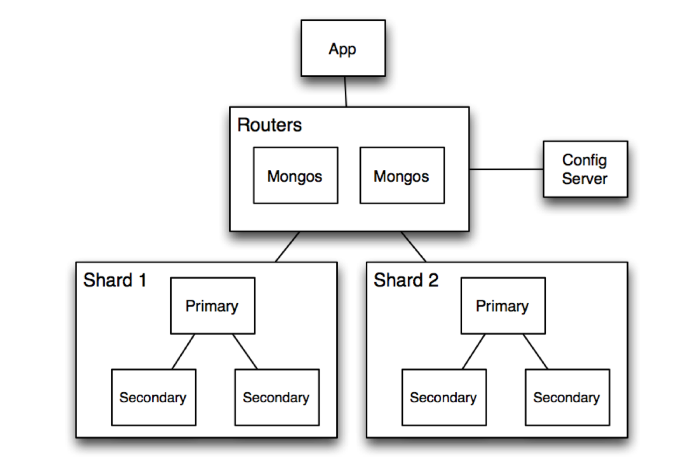

# 7.5. Patrones Cloud

# Sharding

### Visión general

---

### Elementos

### 1. Shards

- Son las unidades principales de **almacenamiento**. Cada **shard** almacena un subconjunto de los datos, definido por una **clave de fragmentación**.
- Cada **shard** puede consistir en un **clúster replicado** (primario y secundarios) para garantizar **alta disponibilidad**.

### 2. Clave de Fragmentación

- Un campo o conjunto de campos en los datos que se utiliza para determinar en qué **shard** se almacenará una entrada.
- La **elección de una clave adecuada** es crítica para garantizar un **balance de datos uniforme**.

### 3. Router

- Es el componente encargado de dirigir las **consultas y operaciones** al **shard** correspondiente, según la **clave de fragmentación**.
- Actúa como **intermediario** entre los **clientes** y los **shards**.

### 4. Configuración Global (Config Server)

- Un conjunto de **metadatos** que describe cómo están distribuidos los datos entre los **shards**.
- Incluye información sobre la **clave de fragmentación**, los **límites de los rangos de datos** en cada **shard**, y otras configuraciones de **enrutamiento**.

### 5. Cliente

- La **aplicación** que interactúa con la base de datos. Las **solicitudes** del **cliente** se redirigen automáticamente al **shard** correspondiente.

---

### Relaciones

### 1. Cliente y Router

- El cliente se conecta únicamente al **router**, que abstrae la complejidad del sistema fragmentado.
- El cliente no interactúa directamente con los **shards**, lo que simplifica la lógica de la aplicación.

### Router y Config Server

- El **router** consulta los **Config Servers** para obtener la información necesaria sobre cómo y dónde se encuentran los datos.

### Router y Shards

- El **router** envía operaciones (lecturas, escrituras, actualizaciones) al **shard** correspondiente en función de la clave de fragmentación.
- Para consultas globales (que afectan múltiples shards), el **router** coordina la ejecución en paralelo y la agregación de los resultados.

### Config Server y Shards

- Los **Config Servers** gestionan y distribuyen información sobre la ubicación y distribución de los datos en los **shards**.
- Los **shards** pueden ser reasignados o reequilibrados dinámicamente según las políticas de distribución.

---

### Restricciones

### 1. Elección de la clave de fragmentación

- La clave debe ser cuidadosamente seleccionada para garantizar un **equilibrio uniforme de datos** entre los shards y evitar puntos calientes (**hotspots**).
- Una mala elección puede provocar **shards desbalanceados** o **sobrecargados**.

### 2. Independencia de los shards

- Cada **shard** opera de forma independiente, por lo que no debe haber dependencias directas entre **shards**.
- Esto asegura que el sistema pueda **escalar horizontalmente** y manejar **fallos individuales**.

### 3. No se permite acceso directo a los shards

- Las aplicaciones **no pueden interactuar directamente con los shards**; todas las operaciones deben pasar por el **router** para mantener la coherencia y la abstracción.

### 4. Configuración distribuida consistente

- Los **Config Servers** deben estar **replicados y consistentes**. Si fallan o pierden consistencia, el sistema puede no ser capaz de enrutar correctamente las solicitudes.

---

### Debilidades

### 1. Complejidad Operacional

- Configurar y mantener un sistema **shard** requiere una **gestión más compleja**, incluyendo:
  - **Monitoreo de shards**.
  - **Reequilibrio de datos**.
  - **Gestión de claves de fragmentación**.

### 2. Dependencia del Router

- El **router** es un punto crítico de acceso. Si se **satura** o **falla**, el sistema puede volverse **inaccesible**.

---

### Fortalezas

### 1. Escalabilidad Horizontal

- La **fragmentación** permite escalar añadiendo nuevos **shards** a medida que crecen los datos.

### 2. Alta Disponibilidad

- Los **shards** y los **Config Servers** pueden estar **replicados**, asegurando **redundancia** y **recuperación ante fallos**.

---

# Message broker

### Visión General

El patrón **Message Broker** utiliza un sistema intermediario para gestionar y distribuir mensajes entre **productores** (componentes que envían datos) y **consumidores** (componentes que procesan los datos). En el caso de **Apache Kafka**, este actúa como un sistema distribuido de mensajería en tiempo real que organiza los mensajes en **topics** y permite que múltiples consumidores y productores interactúen de forma desacoplada.

Kafka está diseñado para manejar grandes volúmenes de datos con **alta disponibilidad** y **escalabilidad**.

### Elementos

### 1. Productores (Producers)

- Aplicaciones o servicios que envían datos (mensajes) al sistema Kafka.
- Los mensajes son enviados a **topics** específicos y pueden incluir claves que determinen su partición dentro del topic.

### 2. Topics

- Unidades lógicas donde se almacenan y organizan los mensajes en Kafka.
- Cada **topic** está dividido en **particiones** para soportar paralelismo y escalabilidad.

### 3. Particiones

- Cada **topic** está compuesto por una o más **particiones**, que son unidades físicas de almacenamiento.
- Los mensajes dentro de una partición se almacenan en un orden secuencial.

### 4. Consumidores (Consumers)

- Aplicaciones o servicios que leen y procesan los mensajes desde los topics.
- Los consumidores pueden agruparse en **grupos de consumidores**, donde cada partición de un topic se asigna exclusivamente a un consumidor dentro del grupo.

### 5. Broker

- Nodo de Kafka que almacena los mensajes de las particiones y maneja las operaciones de productores y consumidores.
- Un **clúster** de Kafka puede contener múltiples brokers para garantizar **alta disponibilidad** y **escalabilidad**.

### 6. Zookeeper (o KRaft en versiones recientes)

- **Zookeeper** coordina las tareas de administración del clúster, como el seguimiento de los brokers activos, particiones y líderes.

### 7. Mensajes

- Datos que se transfieren entre productores y consumidores. Incluyen un **payload** (contenido del mensaje) y **metadatos**, como claves o marcas de tiempo.

### 8. Cluster de Kafka

- Conjunto de brokers que trabajan juntos para almacenar y distribuir datos de forma distribuida y tolerante a fallos.

---

### Relaciones

- **Producers → Topics**: Los productores envían mensajes a un topic especificado, seleccionando particiones (si es necesario) según las claves de los mensajes.
- **Topics → Particiones**: Los topics dividen los mensajes en particiones para soportar la distribución y el procesamiento paralelo.
- **Consumers → Topics**: Los consumidores leen los mensajes de los topics. Si están organizados en un grupo de consumidores, las particiones del topic se distribuyen entre ellos.
- **Brokers ↔ Producers/Consumers**: Los brokers reciben datos de los productores, los almacenan en las particiones y distribuyen los mensajes a los consumidores que los soliciten.
- **Zookeeper ↔ Brokers**: Zookeeper gestiona la coordinación del clúster, incluyendo el seguimiento de líderes de partición, el registro de brokers activos y la sincronización del estado.

### Restricciones

- **Particiones Únicas para Grupos de Consumidores**: Dentro de un grupo de consumidores, cada partición puede ser procesada únicamente por un consumidor a la vez.
- **Persistencia Limitada por Configuración**: Los mensajes en Kafka no se almacenan indefinidamente; el tiempo de retención depende de la configuración del topic.
- **Dependencia de Zookeeper**: Un clúster de Kafka depende de **Zookeeper** para su coordinación. Si esta capa falla, el clúster podría ser inestable.
- **Relación entre Claves y Particiones**: Si no se usan claves en los mensajes, la distribución de los mensajes entre las particiones es aleatoria, lo que puede afectar a la consistencia de ciertos flujos.

### Debilidades del Patrón Message Broker con Kafka

- **Dependencia de la Clave de Mensaje**: La clave del mensaje influye directamente en la partición seleccionada. Si la clave no se diseña adecuadamente, puede generar particiones desbalanceadas.
- **Overhead del Clúster**: En aplicaciones de pequeño o mediano tamaño, Kafka puede introducir más complejidad de la necesaria.

## Fortalezas del Patrón Message Broker con Kafka

- **Escalabilidad Horizontal**: Kafka permite agregar más brokers al clúster para manejar mayores volúmenes de datos y usuarios.
- **Alto Rendimiento**: Soporta flujos de datos en tiempo real y procesamiento concurrente con latencia mínima.
- **Desacoplamiento**: Los productores y consumidores están completamente desacoplados, lo que facilita la evolución independiente de las aplicaciones.
- **Alta Disponibilidad**: Con particiones replicadas, los datos permanecen accesibles incluso si un nodo falla.
