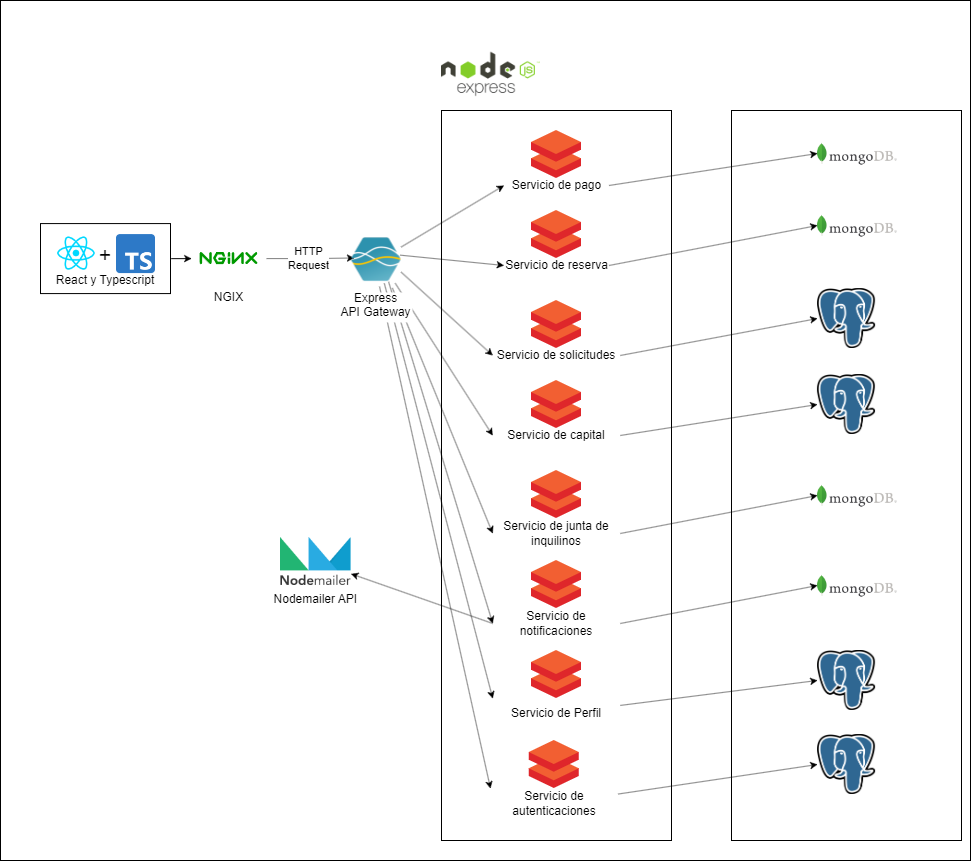

# 9.2. Iteración 1: Definir la estructura general del sistema

### Paso 1: Revisar Entradas

| **Propósito de Diseño**     | **Funcionalidad Primaria**     | **Escenarios de Calidad**       | **Restricciones y Preocupaciones de Arquitectura**      |
|-----------------------------|--------------------------------|---------------------------------|-------------------------------------------------------|
| Crear el diseño desde cero  | CU01, CU02, CU05, CU06      | QA-01, QA-02, QA-04          | CON-01, CON-02, CON-04, CON-05, CON-07, CRN-01, CRN-02 |

### Paso 2: Establecer objetivo de la iteración

Establecer la estructura inicial y funcional del sistema que permita realizar el flujo operativo básico. Generar la estructura inicial y funcional de nuestro sistema para que se pueda hacer el flujo principal de la aplicación **Homesync**, el cual visualiza los departamentos, los reserva y realiza el pago.

### Paso 3: Elegir uno o más elementos del sistema a refinar

#### Diagrama de contexto

Realizando la arquitectura desde cero se tiene para comenzar un diagrama de contexto que representa un sistema de gestión de edificios utilizando el modelo C4.

### Paso 4: Elegir uno o más conceptos de diseño que satisfacen el driver seleccionado

| Código  | Decisión de diseño                                              | Fundamentación                                                                                                                                                                                   |
|---------|-----------------------------------------------------------------|--------------------------------------------------------------------------------------------------------------------------------------------------------------------------------------------------|
| **DEC-01**  | Arquitectura basada en microservicios                            | La elección de microservicios responde a la necesidad de crear un sistema escalable, que permita manejar múltiples funcionalidades (como reservas y pagos) de forma independiente. Asegura una distribución de carga más eficiente (CRN-01, CRN-02) y es adecuado para manejar múltiples solicitudes simultáneas (QA-04).                                                                 |
| **DEC-02**  | Uso de Kafka para la comunicación asíncrona                     | Kafka es adecuado para la comunicación entre microservicios debido a su capacidad de manejar grandes volúmenes de mensajes de manera eficiente, lo que ayuda a mantener la integridad de las transacciones y resuelve las preocupaciones de rendimiento y disponibilidad del sistema (CRN-01, CRN-02, QA-04, CRN-03).                            |
| **DEC-03**  | Escalabilidad horizontal mediante contenedores                   | Utilizar contenedores como Docker para desplegar los microservicios permite escalar el sistema horizontalmente de forma eficiente, gestionando grandes volúmenes de tráfico de usuarios (CON-07, CRN-01, CRN-02).                                       |
| **DEC-04**  | API Gateway con Nginx                                           | La implementación de Nginx como API Gateway permite centralizar el manejo de peticiones, minimizando la latencia y optimizando la gestión del tráfico, lo que facilita la integración con sistemas externos como Stripe para pagos (QA-08, QA-06).                                                                                                                                                                  |
| **DEC-05**  | Integración con Stripe para pagos                               | Stripe es seleccionado por su seguridad y eficiencia en la gestión de transacciones, cumpliendo con los estándares PCI-DSS, lo que resuelve las preocupaciones de seguridad y asegura pagos fiables (CRN-03, QA-03).                                                                                         |
| **DEC-06**  | Uso de bases de datos relacionales y no relacionales (PostgreSQL y MongoDB) | PostgreSQL para datos estructurados y MongoDB para datos no estructurados permite gestionar eficientemente diferentes tipos de información (pagos, reservas, servicios), asegurando la consistencia y optimizando el rendimiento en el manejo de datos (CRN-05, QA-05).                             |

### Paso 5: Instanciar elementos de arquitectura, asignar responsabilidades y definir interfaces

| Código  | Decisión de diseño                                              | Fundamentación                                                                                                                                                                                   |
|---------|-----------------------------------------------------------------|--------------------------------------------------------------------------------------------------------------------------------------------------------------------------------------------------|
| **DEC-07**  | Asignación de microservicios para cada funcionalidad             | Cada microservicio será responsable de una funcionalidad clave: reservas, pagos, visualización de departamentos. Esto asegura escalabilidad y la independencia de cada servicio, permitiendo la gestión eficiente de cargas elevadas (QA-06, QA-13).                                 |
| **DEC-08**  | Definición de colas de mensajes para comunicación (Productor-Consumidor) | Utilizaremos un sistema basado en el patrón productor-consumidor utilizando Kafka. Cada microservicio actúa como productor o consumidor de mensajes, lo que asegura una comunicación asíncrona eficiente, escalable y desacoplada entre los servicios (QA-06, QA-08).                           |
| **DEC-09**  | Uso de API Gateway para centralizar las peticiones               | Nginx se utilizará como API Gateway, centralizando todas las peticiones y aislando los microservicios del tráfico directo. Esto mejora la seguridad, la disponibilidad y la gestión de las solicitudes externas (QA-06, QA-08).                                           |
| **DEC-10**  | Integración con Stripe mediante SDK para pagos                   | Stripe se integrará mediante su SDK para gestionar de manera eficiente y segura las transacciones. Esto asegura el cumplimiento de los estándares PCI-DSS y facilita la monitorización y consistencia de los pagos (CRN-04, QA-03).                               |
| **DEC-11**  | Implementación de Kafka como intermediario de mensajes           | Kafka será el intermediario para la comunicación asíncrona entre microservicios, permitiendo operaciones como reservas y pagos sin bloquear otros servicios. Esto garantiza fiabilidad y escalabilidad en el sistema (QA-04, CRN-01, CRN-02).                                 |
| **DEC-12**  | Asignación de PostgreSQL para gestión de datos estructurados     | PostgreSQL será utilizado para almacenar datos estructurados, como usuarios, reservas y departamentos, debido a su alta capacidad para manejar consultas complejas y garantizar la integridad de los datos (CRN-05, QA-05).                                         |
| **DEC-13**  | MongoDB para almacenamiento de datos no estructurados           | MongoDB será utilizado para almacenar datos no estructurados, como logs y registros de actividad. Su flexibilidad y capacidad para escalar horizontalmente permite una gestión eficiente de grandes volúmenes de datos (QA-06, CRN-05).                                      |

### Paso 6: Bosquejar vistas y registrar decisiones de diseño

### Paso 7: Revision de objetivos

| **No Abordado** | **Parcialmente Abordado** | **Completamente Abordado** | **Decisión de Diseño**  |
|------------------|---------------------------|----------------------------|-------------------------|
|                  | CU-01                     |                            | DEC-08, DEC-03          |
|                  | CU-02                     |                            | DEC-08, DEC-03          |
| CU-03            |                           |                            | -                       |
|                  | QA-01                     |                            | DEC-08                  |
|                  | QA-02                     |                            | DEC-08, DEC-03          |
|                  | QA-03                     |                            | DEC-08                  |
| CON-1            |                           |                            | -                       |
|                  | CON-3                     |                            | DEC-08, DEC-03          |
|                  | CON-4                     |                            | DEC-08, DEC-03          |
|                  | CRN-4                     |                            | DEC-08                  |
|                  | CRN-6                     |                            | DEC-08, DEC-03          |
|                  | CRN-7                     |                            | DEC-08                  |
|                  | CRN-1                     |                            | DEC-08                  |
