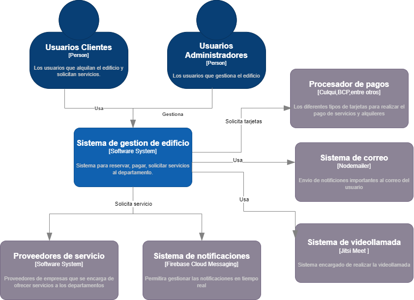

# 9.2. Iteración 1: Definir la estructura general del sistema

### Paso 1: Revisar Entradas

| **Propósito de Diseño**     | **Funcionalidad Primaria**     | **Escenarios de Calidad**       | **Restricciones y Preocupaciones de Arquitectura**      |
|-----------------------------|--------------------------------|---------------------------------|-------------------------------------------------------|
| Crear el diseño desde cero  | CU01, CU02, CU05, CU06      | QA-01, QA-02,QA-03,QA-04          | CON-01, CON-02, CON-04, CON-05, CON-07,CON-09, CRN-01, CRN-02 |

### Paso 2: Establecer objetivo de la iteración

Establecer la estructura inicial y funcional del sistema que permita realizar el flujo operativo básico. Generar la estructura inicial y funcional de nuestro sistema para que se pueda hacer el flujo principal de la aplicación **Homesync**, el cual visualiza los departamentos, los reserva y realiza el pago.

### Paso 3: Elegir uno o más elementos del sistema a refinar

#### Diagrama de contexto

Realizando la arquitectura desde cero se tiene para comenzar un diagrama de contexto que representa un sistema de gestión de edificios utilizando el modelo C4.

### Paso 4: Elegir uno o más conceptos de diseño que satisfacen el driver seleccionado

| **Código**     | **Decisión de diseño**                                                         | **Fundamentación**                                                                                     |
|----------------|---------------------------------------------------------------------------------|--------------------------------------------------------------------------------------------------------|
| **DEC-01**     | **Arquitectura de microservicios**                                               | La arquitectura de microservicios garantiza la **escalabilidad horizontal** y permite separar las funcionalidades críticas de **gestión de pagos y reservas** (CU01, CU02, CU05, CU06), permitiendo manejar grandes volúmenes de tráfico sin problemas. Esto se alinea con las **restricciones de escalabilidad** (CON-07) y la necesidad de **gestión eficiente de la carga** (CRN-01, CRN-02). |
| **DEC-02**     | **Frontend con React y TypeScript**                                              | Utilizando **React con TypeScript** se logra una experiencia de usuario rápida y **segura** para la visualización de pagos y reservas (CU01, CU02, CU05, CU06), lo cual responde a los escenarios de calidad de **usabilidad** (QA-01) y la necesidad de un **sistema claro y accesible** para los usuarios. |
| **DEC-03**     | **Backend con Express y TypeScript**                                             | **Express** proporciona una arquitectura flexible y escalable para manejar solicitudes de pago, reservas y visualización de datos (CU01, CU02, CU05, CU06). La integración con **TypeScript** garantiza la fiabilidad del sistema y minimiza errores en el código, lo cual es importante para cumplir con los atributos de calidad de **usabilidad** y **rendimiento** (QA-02, QA-04). |
| **DEC-04**     | **Comunicación entre microservicios mediante Kafka**                             | **Kafka** será utilizado para asegurar la mensajería **asíncrona eficiente** entre los microservicios responsables de **pagos y reservas** (CU01, CU02, CU05, CU06), cumpliendo con los requisitos de **rendimiento** (QA-04) y **escalabilidad** (CRN-01, CRN-02). |
| **DEC-05**     | **Integración con Stripe para pagos**                                           | **Stripe** se integrará para gestionar de manera segura y eficiente las transacciones de pago (CU01, CU02), respondiendo a los requisitos de **seguridad** en el procesamiento de pagos (QA-03) y a las **restricciones de seguridad** (CON-09). |
| **DEC-06**     | **Uso exclusivo de PostgreSQL**                                                 | **PostgreSQL** se utilizará para el almacenamiento de datos de **reservas y pagos** (CU01, CU02, CU05, CU06), garantizando la **consistencia** y la **integridad** de los datos. Además, su uso asegura la **alta disponibilidad** (CON-07), lo cual es clave para la gestión de grandes volúmenes de información transaccional y de reservas. |

### Paso 5: Instanciar elementos de arquitectura, asignar responsabilidades y definir interfaces

| **Código**     | **Decisión de diseño**                                                         | **Fundamentación**                                                                                     |
|----------------|---------------------------------------------------------------------------------|--------------------------------------------------------------------------------------------------------|
| **DEC-07**     | **Responsabilidad de la gestión de pagos asignada al microservicio de pagos**    | El **microservicio de pagos** será el encargado de procesar las transacciones de pago y garantizar su **seguridad** (CU01, CU02). Esto responde a la **restricción de seguridad** (CON-09) y los **atributos de calidad** relacionados con la protección de datos del usuario (QA-03). |
| **DEC-08**     | **Responsabilidad de la gestión de reservas asignada al microservicio de reservas** | El **microservicio de reservas** se encargará de gestionar las **reservas de departamentos** (CU05, CU06), incluyendo la actualización de datos de departamentos, para ofrecer una experiencia de usuario **rápida y eficiente** (QA-01, QA-02). |
| **DEC-09**     | **API Gateway con Nginx para la gestión de solicitudes**                         | **Nginx** actuará como el **punto de entrada** centralizado para las solicitudes de clientes, redirigiendo las peticiones a los microservicios de pagos y reservas, optimizando el tráfico y garantizando un **rendimiento eficiente** (QA-04) y la **disponibilidad continua** (CON-07). |

### Paso 6: Bosquejar vistas y registrar decisiones de diseño

### Paso 7: Revision de objetivos

| **No Abordado** | **Parcialmente Abordado** | **Completamente Abordado** | **Decisión de diseño (actual)** |
|------------------|---------------------------|----------------------------|----------------------------------|
|                  |                           | CU01                       | DEC-01                          |
|                  |                           | CU02                       | DEC-01                          |
|                  |                           | CU05                       | DEC-01                          |
|                  |                           | CU06                       | DEC-01                          |
|                  | QA-01                     |                            | DEC-01, DEC-02, DEC-03          |
|                  | QA-02                     |                            | DEC-02, DEC-03, DEC-07          |
|                  | QA-03                     |                            | DEC-05                          |
|                  | QA-04                     |                            | DEC-02, DEC-03, DEC-08          |
| CON-01           |                           |                            | DEC-01                          |
| CON-02           |                           |                            | DEC-01, DEC-03                  |
|                  | CON-04                    |                            | DEC-03                          |
|                  | CON-05                    |                            | DEC-03                          |
|                  | CON-07                    |                            | DEC-07, DEC-09                  |
|                  | CRN-01                    |                            | DEC-02, DEC-08                  |
|                  | CRN-02                    |                            | DEC-02, DEC-08                  |
|                  | CRN-03                    |                            | DEC-02                          |

