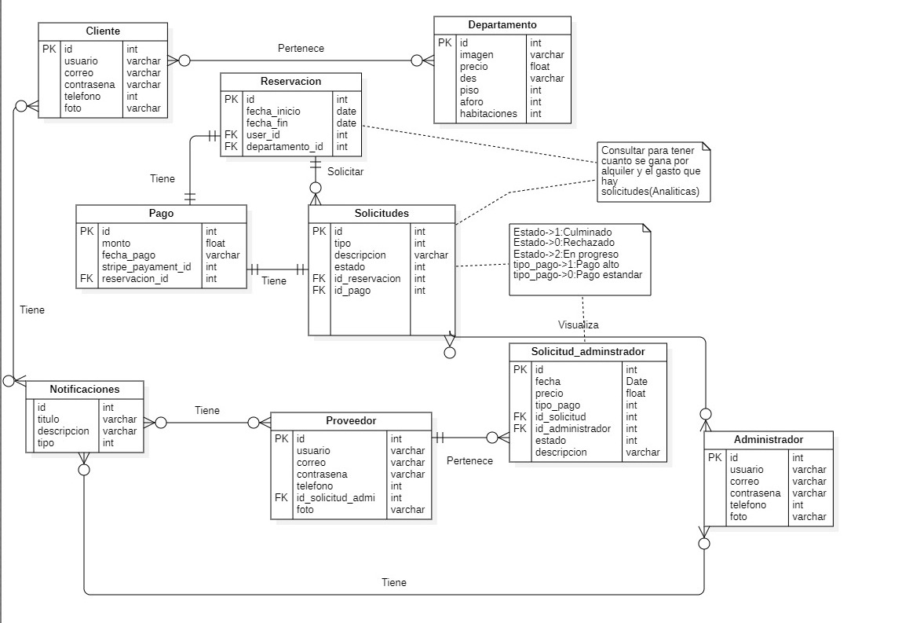

# 9.3. Iteración 2: Identificar estructuras para soportar la funcionalidad primaria

### Paso 1: Revisar Entradas

| **Propósito de Diseño**                              | **Funcionalidad Primaria**                                      | **Escenarios de Calidad**                                            | **Restricciones y Preocupaciones de Arquitectura**                                    |
|------------------------------------------------------|-----------------------------------------------------------------|---------------------------------------------------------------------|------------------------------------------------------------------------------------|
| Gestión de datos mediante APIs y el desarrollo de la interfaz | US-01, UC-02, UC-03, UC-04, UC-05, UC-06, UC-07                 | QA-01, QA-02, QA-03, QA-04, QA-05, QA-06, QA-07                     | CON-1, CON-3, CON-4, CON-5, CRN-04, CRN-06, CRN-07, CRN-02, CRN-01, CRN-03         |

### Paso 2: Establecer objetivo de la iteración

En base a las entradas especificadas, el objetivo de esta primera iteración es realizar un diseño inicial de la estructura de la plataforma, abarcando los atributos más importantes de disponibilidad, rendimiento y seguridad.

### Paso 3: Elegir uno o más elementos del sistema a refinar

#### Diagrama de contexto

Realizando la arquitectura desde cero se tiene para comenzar un diagrama de contexto que representa un sistema de gestión de edificios utilizando el modelo C4.

### Paso 4: Elegir uno o más conceptos de diseño que satisfacen el driver seleccionado

#### Modelo de datos

### Paso 5: Instanciar elementos de arquitectura, asignar responsabilidades y definir interfaces

| **Código** | **Decisión de Diseño**                                           | **Fundamentación**                                                                                                                           |
|------------|------------------------------------------------------------------|-----------------------------------------------------------------------------------------------------------------------------------------------|
| DEC-01     | Los módulos para la generación de tokens                         | Los módulos utilizados para la generación de tokens (JWT) serán gestionados en un módulo independiente como middleware dentro del Api Gateway. |
| DEC-02     | Desarrollo en JavaScript y TypeScript para el backend            | JavaScript es el lenguaje más familiar para el equipo, lo que facilita la ampliación de funcionalidades y mantenimiento del backend. Además, se implementará TypeScript para una gestión de tipos estáticos. |
| DEC-03     | Implementar patrón de sharding                                   | Este patrón mejora la disponibilidad de los datos en bases de datos como MongoDB, distribuyendo los datos entre distintas instancias y asegurando su integridad mediante replicación. En caso de fallo de un shard, otro puede tomar su lugar. |
| DEC-04     | Implementar patrón de pub-sub utilizando Apache Kafka             | Al implementar un patrón de message broker, se podrá centralizar la comunicación entre microservicios, evitando la sobrecarga de transacciones HTTP y optimizando el tráfico de red. Esto mejora la eficiencia de la comunicación en una arquitectura distribuida. |
| DEC-05     | Desarrollo del frontend mediante React                           | React es una tecnología estándar para la creación de aplicaciones web y es ampliamente conocida por el equipo, lo que la convierte en la opción ideal para comenzar el desarrollo del frontend. |

### Paso 6: Bosquejar vistas y registrar decisiones de diseño

### Paso 7: Revision de objetivos

| No abordado | Parcialmente Abordado | Completamente abordado | Decisión de diseno |
|-------------|-----------------------|------------------------|--------------------|
|             |                       | CU-01                  | DEC-01, DEC-02     |
|             |                       | CU-02                  | DEC-01, DEC-02     |
|             | CU-03                 |                        | DEC-04             |
|             | CU-04                 |                        | DEC-03             |
|             | CU-05                 |                        | DEC-03             |
|             | CU-06                 |                        | DEC-04             |
|             | CU-07                 |                        | DEC-01             |
|             |                       | QA-01                  | DEC-05, DEC-01     |
|             |                       | QA-02                  | DEC-01, DEC-02     |
|             | QA-03                 |                        | DEC-05, DEC-01     |
|             | QA-04                 |                        | DEC-03             |
|             | QA-05                 |                        | DEC-03             |
|             | QA-06                 |                        | DEC-03             |
|             |                       | QA-07                  | DEC-01             |
|             | CON-1                 |                        | DEC-03             |
|             | CON-3                 |                        | DEC-01, DEC-02     |
|             | CON-4                 |                        | DEC-01, DEC-02     |
|             | CON-5                 |                        | DEC-03             |
|             | CRN-4                 |                        | DEC-04, DEC-01     |
|             | CRN-6                 |                        | DEC-01, DEC-02     |
|             | CRN-7                 |                        | DEC-05, DEC-01     |
|             |                       | CRN-1                  | DEC-01             |
|             |                       | CRN-2                  | DEC-02             |
|             |                       | CRN-3                  | DEC-04             |
