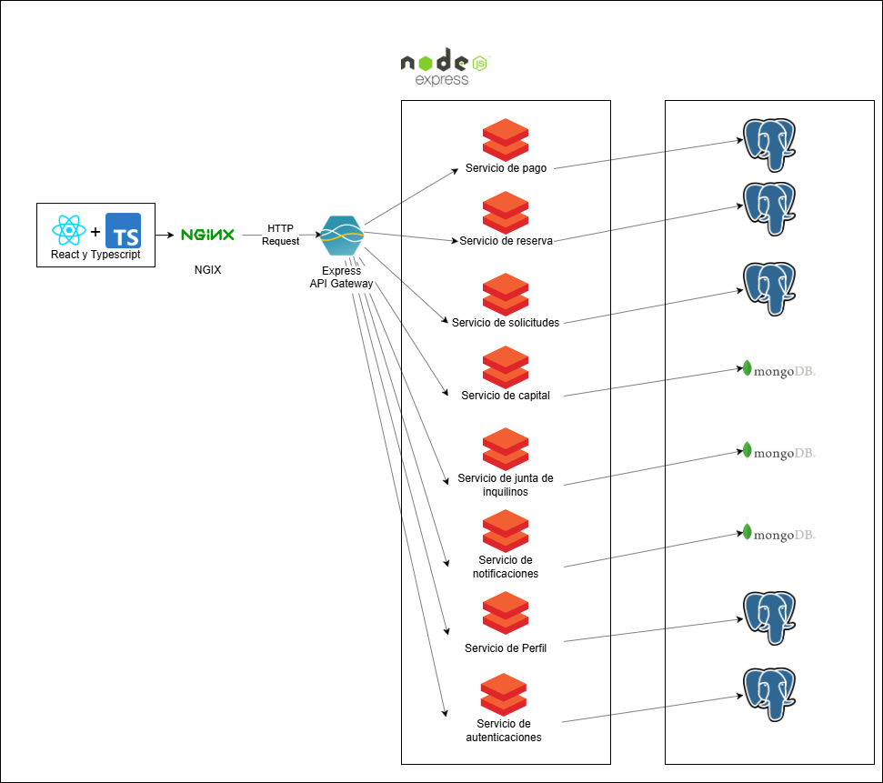

# 9.4. Iteración 3: Refinar estructuras para abordar el atributo de calidad más importante

### Paso 1: Revisar Entradas

| **Propósito de Diseño**                                    | **Funcionalidad Primaria**                                           | **Escenarios de Calidad**                                                | **Restricciones y Preocupaciones de Arquitectura**                                        |
|-------------------------------------------------------------|---------------------------------------------------------------------|---------------------------------------------------------------------------|-----------------------------------------------------------------------------------------|
| Refinar escructuras para abordar el atributo de calidad mas importante | CU-01, CU-02, CU-03, CU-04, CU-05, CU-06, CU-07, CU-08, CU-09, CU-10, CU-11, CU-12, CU-13, CU-14, CU-15, CU-16, CU-17| QA-01, QA-02, QA-03, QA-04, QA-05, QA-06, QA-07, QA-08, QA-09 | CON-01, CON-02, CON-03, CON-04, CON-05, CON-06, CON-07, CON-08, CON-09, CON-10, CON-11| CRN-01, CRN-02, CRN-03, CRN-04, CRN-05, CRN-06, CRN-07, CRN-08, CRN-09, CRN-10 |

### Paso 2: Establecer objetivo de la iteración

El objetivo de esta iteración es fortalecer la seguridad del sistema, garantizando la protección de los datos del usuario y la integridad de las transacciones. Se implementarán medidas para asegurar que los pagos, la gestión de reservas y las solicitudes se manejen de forma confidencial y segura. Además, se mejorará la protección durante la integración con servicios externos como Stripe,Firebase y Jitsi Meet.

### Paso 3: Elegir uno o más elementos del sistema a refinar

En esta iteración, se seleccionarán los siguientes elementos del sistema para refinar: el sistema de pagos, mejorando la seguridad en el procesamiento de pagos y protegiendo los datos sensibles del usuario durante las transacciones; la gestión de reservas, optimizando la seguridad en el proceso de reserva y cancelación de departamentos para proteger la información del usuario; y la integración con servicios externos, revisando la seguridad en la integración con Stripe, Firebase y Jitsi Meet, asegurando que las comunicaciones y transacciones sean seguras y que la privacidad del usuario esté protegida.

### Paso 4: Elegir uno o más conceptos de diseño que satisfacen el driver seleccionado

| **Código** | **Decisión de Diseño**                                                                 | **Fundamentación**                                                                                                                                                                                                                     |
|------------|-----------------------------------------------------------------------------------------|--------------------------------------------------------------------------------------------------------------------------------------------------------------------------------------------------------------------------------------|
| **DEC-19** | Implementación de encriptación para pagos y transacciones de reservas                   | Para mejorar la seguridad en las transacciones, se implementará encriptación en tránsito (SSL/TLS) y en reposo (AES-256) para proteger los datos sensibles del usuario durante las transacciones, como los pagos y la información de reservas (CU01, CU02, CU05, CU06). Esto cumple con los requisitos de seguridad (QA-03) y confidencialidad (QA-05). |
| **DEC-20** | Integración de autenticación multifactor (MFA) para acceder a la plataforma               | Se implementará un sistema de autenticación multifactor (MFA) para garantizar que solo los usuarios autorizados puedan acceder al sistema, protegiendo las cuentas de usuario y las operaciones críticas como pagos, reservas y solicitudes (CU01, CU05, CU06). Esto cubre las preocupaciones de seguridad (QA-03, CRN-01). |
| **DEC-21** | Uso de OAuth 2.0 para integración con servicios externos como Stripe, Firebase y Jitsi Meet | Para mejorar la seguridad en la integración con servicios externos, se implementará OAuth 2.0, garantizando que las credenciales del usuario no se compartan con servicios externos y protegiendo la información durante las comunicaciones y transacciones (CU13, CU15, CRN-03). Esto garantiza un control de acceso robusto y confiable. |
| **DEC-22** | Auditoría y monitoreo de transacciones para asegurar la integridad y seguridad del sistema | Se implementará un sistema de auditoría para monitorear y registrar todas las transacciones relacionadas con pagos, reservas y solicitudes. Esto permitirá identificar actividades sospechosas y garantizar la trazabilidad (QA-02, CRN-04). |
| **DEC-23** | Protección contra ataques de denegación de servicio (DDoS) en todos los microservicios | Se implementarán medidas de defensa contra DDoS, como el uso de firewalls de aplicaciones web (WAF) y redes de distribución de contenido (CDN), para proteger la plataforma y garantizar la disponibilidad (QA-04, CRN-05). |
| **DEC-24** | Implementación de pruebas de seguridad automatizadas (penetración y pruebas de vulnerabilidades) | Para garantizar que el sistema sea seguro y libre de vulnerabilidades, se establecerán pruebas automatizadas de penetración y análisis de vulnerabilidades en cada versión del sistema (QA-03, QA-02, CRN-06). Esto asegurará que los datos y las transacciones estén protegidos contra amenazas externas. |

### Paso 5: Instanciar elementos de arquitectura, asignar responsabilidades y definir interfaces

| **Código** | **Decisión de Diseño**                                                                     | **Fundamentación**                                                                                                                                                                           |
|------------|-------------------------------------------------------------------------------------------|--------------------------------------------------------------------------------------------------------------------------------------------------------------------------------------------|
| **DEC-25** | Implementación de servicio de pago utilizando **Stripe** con encriptación de datos          | El microservicio de pagos se integrará con **Stripe** para procesar pagos, asegurando que las transacciones sean encriptadas y seguras. Se utilizará un canal HTTPS seguro y el sistema implementará un proceso de validación de pagos robusto (CU01, CU02, CU05).                                      |
| **DEC-26** | Responsabilidad del microservicio de reservas encriptadas asignada al servicio de reservas | El microservicio de **reservas** se encargará de gestionar las reservas y cancelaciones de departamentos. Este microservicio estará diseñado para manejar la encriptación de los datos sensibles, asegurando la confidencialidad de los usuarios y transacciones (CU05, CU06).                                  |
| **DEC-27** | Integración de **OAuth 2.0** para las integraciones con servicios de terceros (Firebase, Jitsi Meet, Stripe) | Se implementará **OAuth 2.0** en todos los servicios de terceros para asegurar que las credenciales de acceso estén protegidas durante la comunicación entre plataformas. Los microservicios interactuarán con servicios externos a través de esta capa de autenticación (CU13, CU15).                                         |
| **DEC-28** | Monitoreo de transacciones críticas asignado al servicio de auditoría                      | El servicio de **auditoría** será responsable de registrar todas las transacciones críticas en la plataforma (pagos, reservas y solicitudes). Las auditorías se almacenarán en bases de datos seguras, y los datos estarán disponibles para revisiones posteriores si es necesario (QA-02, CRN-04).                     |
| **DEC-29** | Implementación de medidas de defensa contra **DDoS** en todos los microservicios            | Los microservicios estarán protegidos por un sistema de defensa contra DDoS, incluyendo el uso de **firewalls de aplicaciones web (WAF)** y **CDNs** para mejorar la resistencia a ataques masivos (QA-04, CRN-05).                                                                 |
| **DEC-30** | Implementación de pruebas de penetración automatizadas en cada microservicio                | Se implementarán herramientas de pruebas de penetración automatizadas en los servicios clave, como los microservicios de pagos, reservas y notificaciones, para identificar y corregir vulnerabilidades de seguridad antes de que se desplieguen (QA-03, QA-02).                                           |

### Paso 6: Bosquejar vistas y registrar decisiones de diseño

### Paso 7: Revision de objetivos

| **No abordado**     | **Parcialmente Abordado**  | **Completamente Abordado**   | **Decisión de diseño**                                    |
|---------------------|----------------------------|------------------------------|----------------------------------------------------------|
|                     |                            | CU-01                        | DEC-19, DEC-25                                            |
|                     |                            | CU-02                        | DEC-19, DEC-25                                            |
|                     |                            | CU-03                        | DEC-20, DEC-24                                            |
|                     |                            | CU-04                        | DEC-23, DEC-30                                            |
|                     |                            | CU-05                        | DEC-19, DEC-20                                            |
|                     |                            | CU-06                        | DEC-19, DEC-20                                            |
|                     |                            | CU-07                        | DEC-20, DEC-21                                            |
|                     |                            | CU-08                        | DEC-24                                                    |
|                     |                            | CU-09                        | DEC-21                                                    |
|                     |                            | CU-10                        | DEC-22, DEC-28                                            |
|                     |                            | CU-11                        | DEC-22, DEC-28                                            |
|                     |                            | QA-01                        | DEC-19, DEC-24                                            |
|                     |                            | QA-02                        | DEC-24, DEC-30                                            |
|                     |                            | QA-03                        | DEC-19, DEC-24, DEC-30                                    |
|                     |                            |   QA-04                      | DEC-23, DEC-29                                            |
|                     |                            | QA-05                        | DEC-19, DEC-20                                            |
|                     |                 QA-06            |                        | DEC-20                                                    |
|                     |                            | QA-07                        | DEC-20                                                    |
|                     |                            | QA-08                        | DEC-24                                                    |
|                     |                            | QA-09                        | DEC-23                                                    |
|                     |                            | QA-10                        | DEC-22                                                    |
|                     |                            | QA-11                        | DEC-24                                                    |
|                     |                            | CON-1                        | DEC-20, DEC-25                                            |
|                     |                            | CON-2                        | DEC-23                                                    |
|                     |                            | CON-3                        | DEC-19, DEC-20                                            |
|                     |                            | CON-4                        | DEC-19, DEC-20                                            |
|                     |                            | CON-5                        | DEC-21                                                    |
|                     |                            | CON-6                        | DEC-24                                                    |
|                     |                            | CRN-4                        | DEC-21, DEC-25                                            |
|                     |                            | CRN-6                        | DEC-24                                                    |
|                     |                            | CRN-7                        | DEC-21, DEC-19                                            |
|                     |                            | CRN-1                        | DEC-19                                                    |
|                     |                            | CRN-2                        | DEC-20                                                    |
|                     |                            | CRN-3                        | DEC-23                                                    |
|                     |                            | CRN-5                        | DEC-24                                                    |
|                     |                            | CRN-8                        | DEC-21                                                    |
