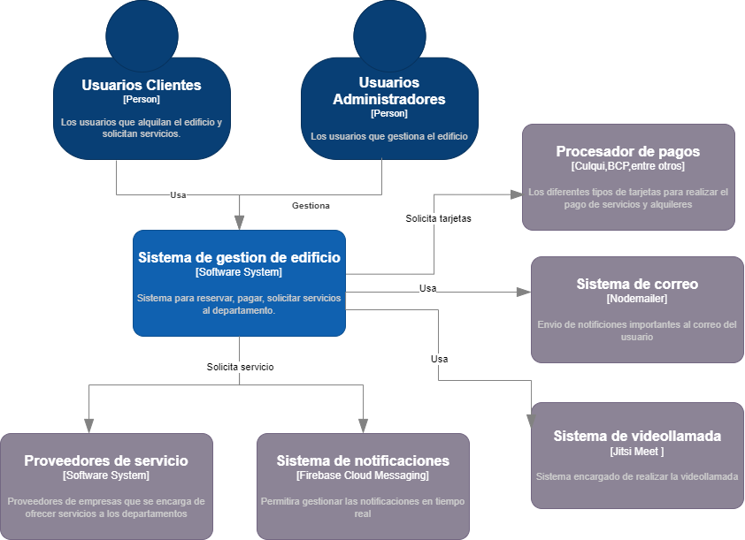

# 9.4. Iteración 3: Refinar estructuras para abordar el atributo de calidad más importante

### Paso 1: Revisar Entradas

| **Propósito de Diseño**                                    | **Funcionalidad Primaria**                                           | **Escenarios de Calidad**                                                | **Restricciones y Preocupaciones de Arquitectura**                                        |
|-------------------------------------------------------------|---------------------------------------------------------------------|---------------------------------------------------------------------------|-----------------------------------------------------------------------------------------|
| Gestión de datos mediante APIs y el desarrollo de la interfaz | US-01, UC-02, UC-03, UC-04, UC-05, UC-06, UC-07, UC-08, UC-09, UC-10, UC-11 | QA-01, QA-02, QA-03, QA-04, QA-05, QA-06, QA-07, QA-08, QA-09, QA-10, QA-11 | CON-1, CON-2, CON-3, CON-4, CON-5, CON-6, CRN-01, CRN-02, CRN-03, CRN-04, CRN-05, CRN-06, CRN-07, CRN-08 |

### Paso 2: Establecer objetivo de la iteración

En base a las entradas especificadas, el objetivo de esta primera iteración es realizar un diseño inicial de la estructura de la plataforma, abarcando los atributos más importantes de disponibilidad, rendimiento y seguridad.

### Paso 3: Elegir uno o más elementos del sistema a refinar

#### Diagrama de contexto

Realizando la arquitectura desde cero se tiene para comenzar un diagrama de contexto que representa un sistema de gestión de edificios utilizando el modelo C4.

### Paso 4: Elegir uno o más conceptos de diseño que satisfacen el driver seleccionado

#### Modelo de datos

### Paso 5: Instanciar elementos de arquitectura, asignar responsabilidades y definir interfaces

| **Código** | **Decisión de Diseño**                                           | **Fundamentación**                                                                                                                           |
|------------|------------------------------------------------------------------|-----------------------------------------------------------------------------------------------------------------------------------------------|
| DEC-08     | Uso de módulos independientes para la generación de tokens      | Los módulos encargados de generar tokens (JWT) se gestionarán de manera independiente como middleware dentro del Api Gateway, asegurando modularidad y un manejo centralizado. |
| DEC-03     | Desarrollo del backend utilizando JavaScript y TypeScript        | JavaScript es el lenguaje más familiar para el equipo, lo que facilita la ampliación y mantenimiento del backend. Además, se implementará TypeScript para mejorar la seguridad de tipos y la escalabilidad del código. |

### Paso 6: Bosquejar vistas y registrar decisiones de diseño

### Paso 7: Revision de objetivos

| No abordado | Parcialmente Abordado | Completamente abordado | Decisión de diseno |
|-------------|-----------------------|------------------------|--------------------|
|             |                       | CU-01                  | DEC-01, DEC-02     |
|             |                       | CU-02                  | DEC-01, DEC-02     |
|             |                       | CU-03                  | DEC-04             |
|             |                       | CU-04                  | DEC-03             |
|             |                       | CU-05                  | DEC-03             |
|             |                       | CU-06                  | DEC-04             |
|             |                       | CU-07                  | DEC-01             |
|             | CU-08                 |                        | DEC-05, DEC-01     |
|             | CU-09                 |                        | DEC-04             |
|             | CU-10                 |                        | DEC-03             |
|             | CU-11                 |                        | DEC-05             |
|             |                       | QA-01                  | DEC-05, DEC-01     |
|             |                       | QA-02                  | DEC-01, DEC-02     |
|             |                       | QA-03                  | DEC-05, DEC-01     |
|             |                       | QA-04                  | DEC-03             |
|             |                       | QA-05                  | DEC-03             |
|             |                       | QA-06                  | DEC-03             |
|             |                       | QA-07                  | DEC-01             |
|             | QA-08                 |                        | DEC-05             |
|             | QA-09                 |                        | DEC-04             |
|             | QA-10                 |                        | DEC-03             |
|             | QA-11                 |                        | DEC-05             |
|             |                       | CON-1                  | DEC-03             |
|             |                       | CON-2                  | DEC-05             |
|             |                       | CON-3                  | DEC-01, DEC-02     |
|             |                       | CON-4                  | DEC-01, DEC-02     |
|             | CON-5                 |                        | DEC-03             |
| CON-6       |                       |                        | DEC-04             |
|             |                       | CRN-4                  | DEC-04, DEC-01     |
|             |                       | CRN-6                  | DEC-01, DEC-02     |
|             |                       | CRN-7                  | DEC-05, DEC-01     |
|             |                       | CRN-1                  | DEC-01             |
|             |                       | CRN-2                  | DEC-02             |
|             |                       | CRN-3                  | DEC-04             |
|             | CRN-5                 |                        | DEC-03             |
| CRN-8       |                       |                        | DEC-05             |
